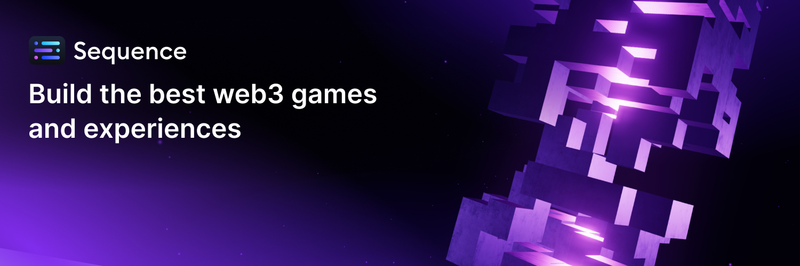

# Sequence Documentation
Welcome to the Sequence docs! Your infrastructure for chains, games, and apps.

## Development

Install the [Mintlify CLI](https://www.npmjs.com/package/mintlify) to preview the documentation changes locally. To install, use the following command

```
npm i -g mintlify
```

Run the following command at the root of your documentation (where docs.json is)

```
mintlify dev
```

We use Mintlify as the documentation framework. For more information on what components are available to structure your content, please refer to their [documentation](https://mintlify.com/docs/page).


## Contributing

We welcome contributions from the community to help improve our documentation! Here's how you can contribute:

1. **Fork the repository** and create your branch from `main`.
2. **Make your changes** to the documentation.
3. **Test your changes** locally using the Mintlify CLI. We also recommend running `mintlify broken-links` after adding your changes and before creating a PR to validate any broken-links.
4. **Submit a pull request** with a clear description of your changes.

Our team reviews pull requests regularly and will provide feedback as needed. For substantial changes, please open an issue first to discuss what you'd like to change.

If you find any errors or have suggestions for improvements but don't want to contribute directly, please open an issue describing the problem or enhancement.

Thank you for helping make Sequence documentation better for everyone!

### Troubleshooting

Mintlify has a max capacity for large files such as high quality images or videos. If you deploy and your video or image is not showing on the preview link in your PR, we recommend deploying these first to a CDN in order to serve them.
