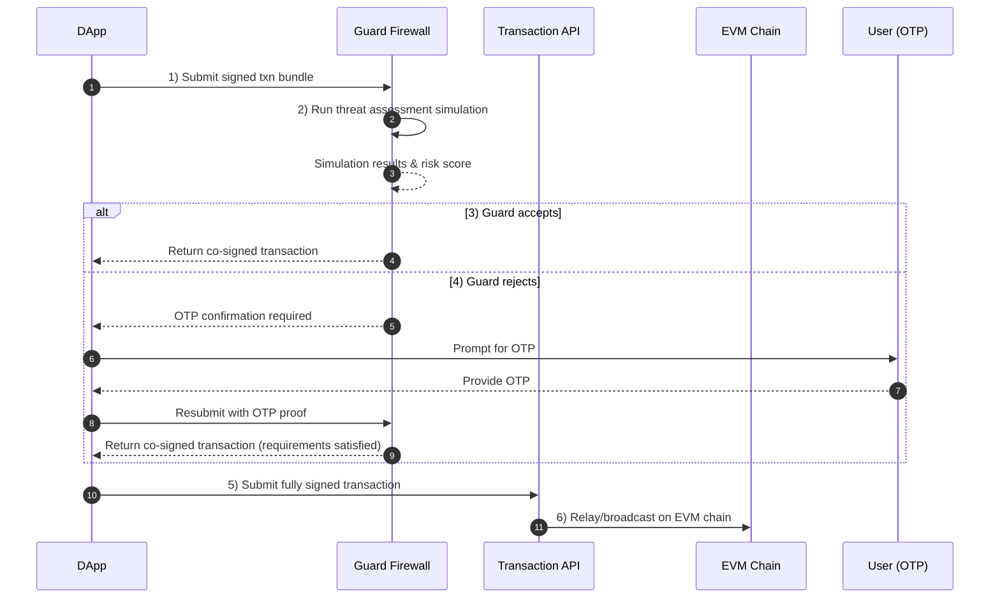
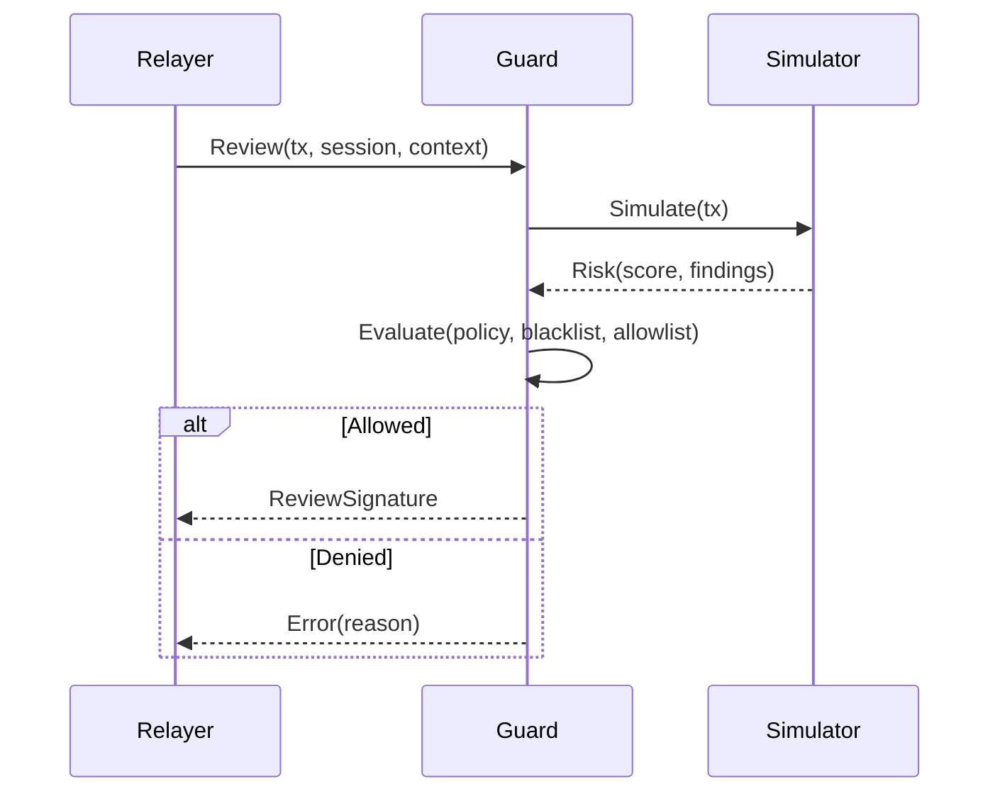

**Guard Firewall** es un firmante de revisión operado por Sequence que evalúa las transacciones antes de que se envíen a la blockchain. Hace cumplir políticas del ecosistema, realiza simulaciones de amenazas mediante integraciones de terceros y puede bloquear o permitir transacciones firmando o reteniendo una **firma de guardia**. Los administradores del ecosistema también pueden mantener **listas negras** de aplicaciones o contratos maliciosos.

## Modelo de políticas
Las políticas se configuran por ecosistema y pueden incluir:
- **Registro de aplicaciones y listas negras**: solo las aplicaciones/orígenes registrados pueden enviar; los administradores pueden poner en lista negra dapps o contratos.
- **Umbrales de riesgo**: bloquea transacciones que superen un puntaje de riesgo devuelto por el simulador.
- **Listas blancas de métodos y contratos**: restringe qué contratos y funciones pueden ser llamados.
- **Límites de gasto y reglas de tokens**: limita los egresos por intervalo según token, destinatario o aplicación.
- **Interruptor de emergencia**: modo de cierre total que bloquea todos los ámbitos o ámbitos específicos.

## Simulación de amenazas
Guard puede realizar análisis de amenazas en tiempo real sobre el payload de la transacción (calldata, valor, cambios de estado). Según la configuración del ecosistema, Guard aplica los umbrales de política y firma o rechaza la transacción, o bien solicita confirmación por OTP.

## Controles de listas negras

- Los administradores pueden poner en lista negra aplicaciones, orígenes o contratos. Las listas negras tienen prioridad y provocan rechazos inmediatos.
- Las listas se propagan a Guard y se almacenan en caché con TTL corto; las actualizaciones son casi en tiempo real.

## Notas operativas

- **Cierre total**: si Guard no está disponible y la política requiere una firma de revisión, las transacciones se bloquean.
- **Auditabilidad**: las decisiones se registran con los insumos (hashes), respuestas del simulador, versión de la política y códigos de motivo.
- **Rendimiento**: se utiliza caché y simulación incremental para mantener la latencia baja; los timeouts por defecto niegan para evitar saltos de control.

## Guía de implementación

- Requiere una **firma de Guard** en su sesión o política de wallet para que las transacciones no puedan saltarse la revisión.
- Registre aplicaciones y orígenes en la administración de su ecosistema, defina políticas y establezca umbrales de riesgo.
- Mantenga listas negras actualizadas y responda rápidamente a información sobre incidentes.