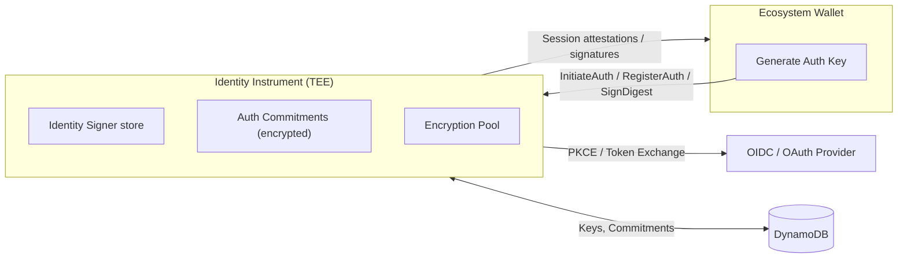
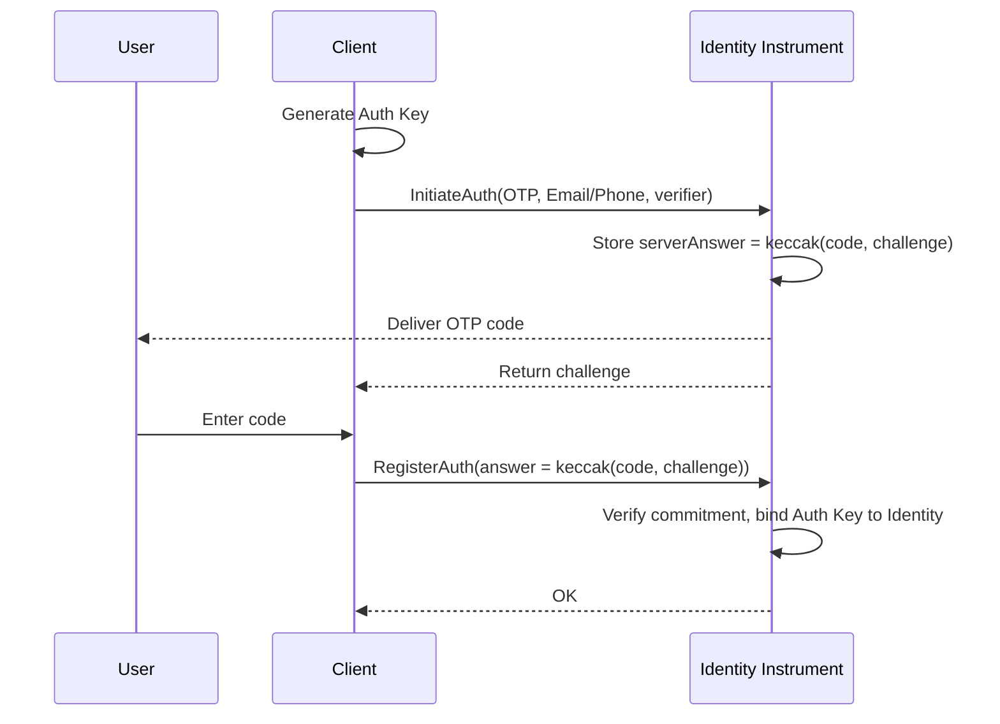
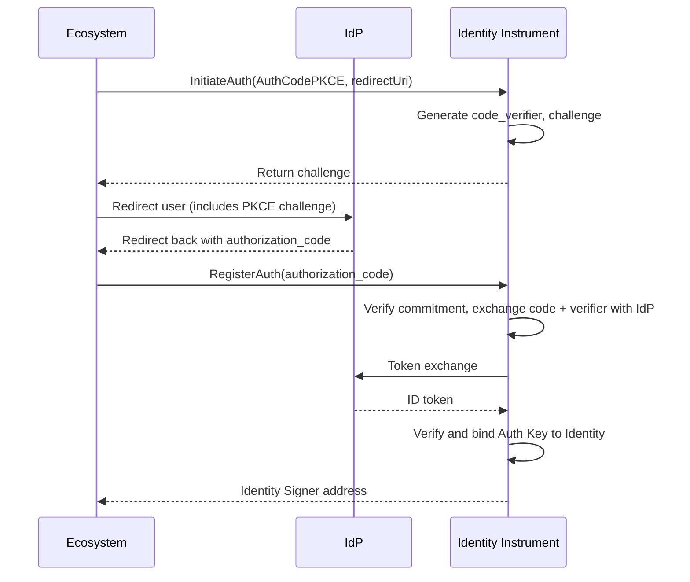

**Identity Instrument** es un servicio respaldado por enclave (TEE en AWS Nitro Enclaves) responsable de autenticar usuarios mediante confirmación por correo electrónico/teléfono vía OTP o un proveedor de identidad compatible con OIDC (IdP, como Google o Apple). Vincula una **Auth Key** generada por el dispositivo al usuario autenticado y utiliza un **Identity Signer** para firmar atestaciones o resúmenes de sesión. Las aplicaciones nunca manejan directamente los secretos de cliente del IdP; Identity Instrument media el intercambio y emite la firma final.

## Architecture
A continuación se muestra un diagrama de arquitectura de alto nivel de Identity Instrument.

## Atestación criptográfica
Identity Instrument se implementa desde un EIF (Enclave Image File) publicado como un release público en GitHub. Un EIF se construye de manera determinista a partir del código fuente y se derivan un conjunto de **mediciones** de todo el código incluido en la compilación. Esto significa que una compilación en un commit específico siempre producirá las mismas mediciones.

Estas mediciones son **atestiguadas** por el sistema AWS Nitro, que asegura que son válidas para el build exacto que describen. Esto se realiza mediante un documento llamado **atestación criptográfica** que es firmado por la PKI de AWS (Infraestructura de Clave Pública), y puede ser validado por cualquier persona.

La atestación se incluye en cada solicitud a AWS KMS, que verifica su validez. Trusted Third Parties (TTPs) (entidades encargadas de gestionar las claves KMS usadas para cifrar los datos de Identity Instrument) configuran las claves KMS con políticas que solo permiten el acceso si el EIF correcto está desplegado, identificado por sus mediciones.

Cada respuesta de Identity Instrument contiene la atestación en el encabezado HTTP `X-Attestation-Document`. Todo lo anterior garantiza que Identity Instrument sea seguro y **verificable públicamente**.

## Modos de autenticación
Identity Instrument soporta dos modos de autenticación:
- Autenticación OTP (correo/teléfono)
- OAuth AuthCode con PKCE (mediado por el ecosistema)

### Autenticación OTP (correo/teléfono)
El modo de autenticación `OTP` se utiliza para enviar un código generado aleatoriamente directamente al destino especificado por el usuario. Ese destino se convierte en la identidad con la que se asocia la Auth Key. La forma en que se envía el código depende del tipo de identidad utilizado (por ejemplo, correo electrónico, mensaje de texto, etc.), pero en todos los casos el flujo es el mismo.

El Identity Signer se recupera o crea según el destino (correo electrónico, número de teléfono, etc.)

### OAuth AuthCode con AuthCodePKCE
El modo de autenticación AuthCodePKCE utiliza el "Authorization Code Flow" de OAuth2 para obtener el perfil del usuario desde un proveedor de identidad externo. Al usar la extensión PKCE de OAuth2 (Proof of Key Code Exchange), el cliente nunca puede intercambiar el código de autorización, incluso si posee el Client Secret. Esto se garantiza mediante un Code Verifier aleatorio que es generado y almacenado de forma segura por Identity Instrument. Su hash, llamado Code Challenge, es usado por el cliente para iniciar el proceso de autenticación con el IdP. El Code Verifier original es enviado por Identity Instrument junto con la solicitud de token. El proveedor de identidad verifica que el hash coincida con el valor enviado en la solicitud inicial, evitando el intercambio de tokens si el proceso no fue iniciado por Identity Instrument.

## Encryption Pool
Identity Instrument cifra sus datos (como las claves privadas EOA de los firmantes) usando AES-256-CBC con claves privadas seleccionadas aleatoriamente de un global cipher key pool. Cada una de estas claves de cifrado se divide en 3 partes usando el esquema de compartición secreta de Shamir, requiriendo al menos 2 partes para descifrar una clave determinada. Cada parte se cifra luego con una clave KMS remota diferente de AWS. Solo los cifrados resultantes se almacenan en la base de datos de Identity Instrument.

Dos de las claves KMS son propiedad y están controladas por Trusted Third Parties independientes, organizaciones no afiliadas a Sequence. La tercera KMS es propiedad y está controlada por Sequence.

Esto significa que, al final, cada clave privada de firmante está protegida por una configuración remota 2/3, donde ninguna entidad tiene acceso completo a los datos. Al mismo tiempo, perder un Trusted Third Party no compromete el sistema ni provoca pérdida de datos, siempre que los otros 2 TTP sigan activos.

## Propiedades de seguridad

- Las aplicaciones nunca reciben los secretos de cliente del IdP; solo el enclave realiza el intercambio.
- PKCE previene la interceptación de códigos durante los redireccionamientos OAuth.
- La atestación del enclave permite a los ecosistemas verificar que están interactuando con el binario de servicio correcto.
- La rotación de claves y migraciones de configuración son compatibles sin tiempo de inactividad gracias a las generaciones del pool.

## Referencias

- [Repositorio de Identity Instrument en Github](https://github.com/0xsequence/identity-instrument)
- [TEE Verifier (TypeScript)](https://github.com/0xsequence/tee-verifier.js)
- [TEE Verifier (Go)](https://github.com/0xsequence/tee-verifier)