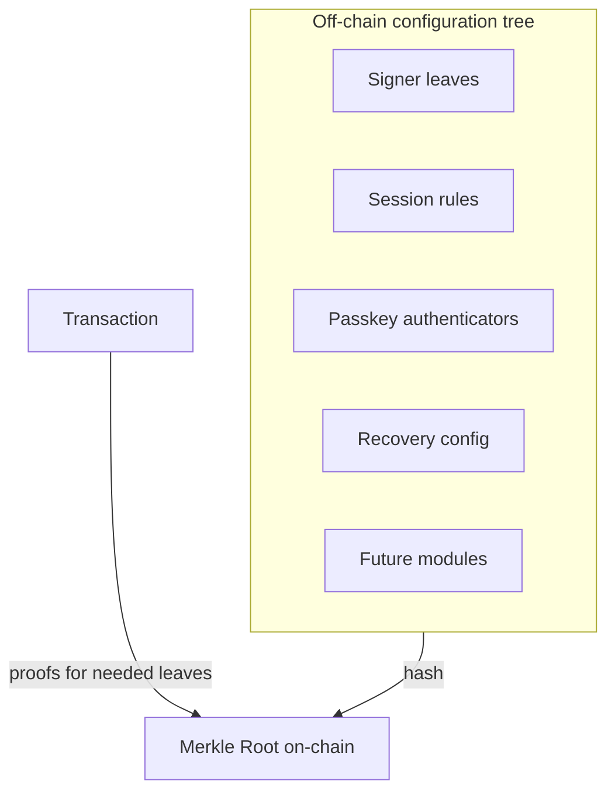
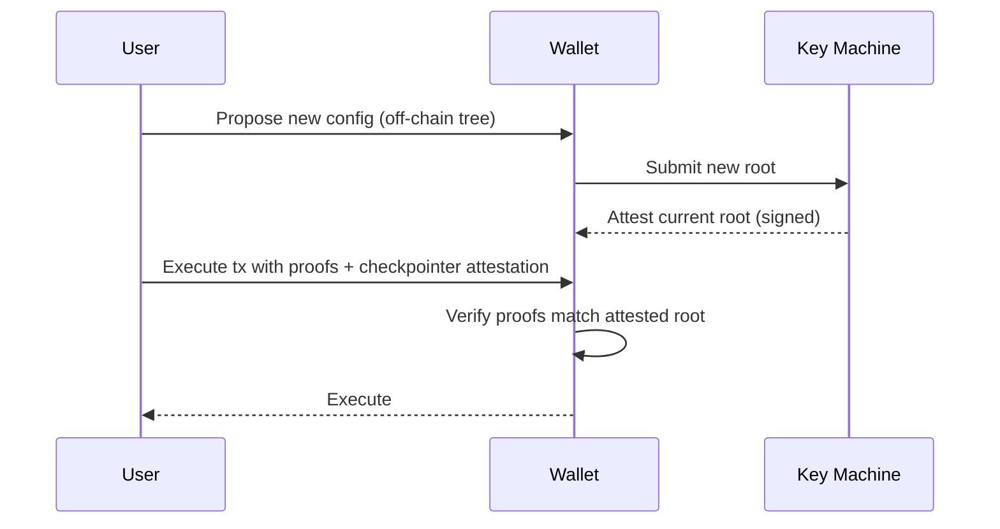

Ecosystem Wallets almacenan una sola **raíz Merkle** en la blockchain que compromete toda la configuración del wallet: firmantes, pesos, umbrales, autenticadores de passkey, reglas de Smart Session, mecanismos de recuperación y futuras extensiones. Las acciones proporcionan **pruebas Merkle** para validar las partes de la configuración relevantes en el momento de la ejecución.

## Model

- **Root**: el contrato de la wallet almacena una raíz hash.
- **Hojas**: registros tipados para firmantes, sesiones, recuperación, passkeys y módulos.
- **Extensiones**: los módulos interpretan tipos de hoja específicos (por ejemplo, control de sesiones, passkeys).
- **Pruebas**: la ejecución proporciona pruebas de Merkle para las hojas que necesita (por ejemplo, peso del firmante, regla de sesión).

## Actualización de configuración
Las actualizaciones de configuración (agregar dispositivo, cambiar límites de sesión, rotar llaves) ocurren fuera de la cadena calculando un nuevo árbol y raíz. El servicio **Key Machine** certifica la última raíz; las transacciones pueden incluir o referenciar esta certificación para que la wallet acepte solo la configuración más reciente.

## Smart Sessions y Passkeys

- **Smart Sessions**: las hojas definen los alcances para una llave de sesión (contratos/funciones permitidas, límites de gasto, expiraciones). La ejecución valida la llave de sesión y las pruebas de reglas antes de permitir acciones.
- **Passkeys**: los autenticadores de passkey son hojas; los dispositivos generan firmas WebAuthn que la extensión de passkey valida usando la prueba de hoja correspondiente.

## Recuperación

- **Llaves de recuperación temporizadas**: una hoja de recuperación codifica una ventana de bloqueo temporal; iniciar la recuperación comienza una cuenta regresiva donde los firmantes existentes pueden cancelar. Tras la expiración, la llave de recuperación puede rotar los firmantes principales.

## Eficiencia

- Solo la raíz se almacena en la cadena; las pruebas se proporcionan como calldata cuando se necesitan.
- Las técnicas de empaquetado y mapas de bits minimizan el calldata en casos multi-sig o de múltiples pruebas.

## Coherencia entre cadenas

- La misma raíz gobierna todas las cadenas para una wallet; las certificaciones de checkpointer permiten que cada red acepte solo la raíz canónica, evitando repeticiones con configuraciones antiguas.

## Referencias

- [Wallet Contracts](https://github.com/0xsequence/wallet-contracts-v3)