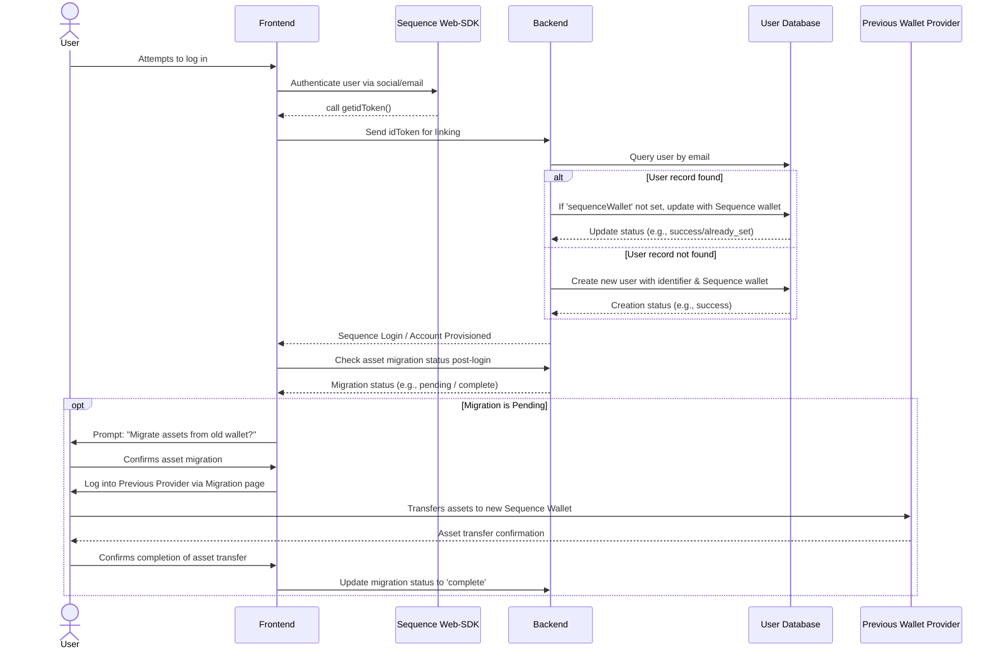

## Descripción general
Este documento brinda orientación para usuarios que migran desde otros proveedores (como Thirdweb, Venly, etc.) a Sequence Embedded Wallets. El enfoque principal recomendado es el patrón de migración Just-In-Time (JIT), que ocurre cuando los usuarios inician sesión por primera vez después de la migración.

<CardGroup>
  <Card title="De ThirdWeb a Sequence" icon="book" href="/solutions/wallets/embedded-wallet/migration#migrating-from-thirdweb-to-sequence">
    Siga esta guía para migrar de ThirdWeb In-App Wallets a Sequence.
  </Card>
</CardGroup>

## Proceso de migración recomendado
El proceso de migración está diseñado para facilitar la transición de los usuarios desde su proveedor de wallet actual hacia Sequence Embedded Wallets, con una mínima interrupción en su experiencia. Nuestro Web-SDK utiliza métodos de wagmi internamente, por lo que la mayoría de la lógica existente en su aplicación será compatible. Este proceso ocurre automáticamente cuando un usuario inicia sesión por primera vez después de que se haya implementado la migración, siguiendo generalmente el siguiente flujo:



1.  **Autenticación del usuario**
    - Cuando un usuario intenta iniciar sesión, se autentica con su proveedor social o correo electrónico preferido usando un SDK de Sequence.
    - Una vez autenticado, los datos del usuario como el correo electrónico u otro identificador único, junto con la dirección de la wallet de Sequence, se envían a su backend.

    Puede solicitar un `idToken` específico de Sequence desde el SDK de Sequence y enviarlo a su backend para verificar el correo electrónico y la dirección del usuario, y así vincularlo en su backend.

    [Aquí](https://docs.sequence.xyz/sdk/headless-wallet/verification) está la guía para solicitar el token desde su frontend y verificarlo en su backend.

2.  **Consulta y actualización de base de datos**
    Ahora que hemos verificado las credenciales en su backend, podemos modificar su base de datos de usuarios para rastrear si ya existe una wallet de Sequence para ese usuario.
    - Actualice su base de datos de usuarios agregando una columna 'sequenceWallet'.
    - La base de datos se consulta con el identificador único del usuario para recuperar el registro correspondiente.
    - El sistema verifica si ya existe una 'sequenceWallet' para este usuario. Si es así, no se realiza ninguna acción.
    - Si no se encuentra una dirección de wallet de Sequence:
      a. El wallet de Sequence recibido se inserta en la columna 'sequenceWallet'.
    - Si el usuario no existe en la base de datos, inserte la información recibida como un usuario nuevo.

3.  **Migración de activos**
    - Después de que el usuario inicia sesión correctamente, el sistema verifica si la migración de activos ya se realizó.
    - Si no existe, se muestra un mensaje al usuario explicando la necesidad de migrar sus activos de su wallet anterior a la nueva wallet de Sequence.
    - El usuario inicia sesión en el proveedor anterior como un evento único a través de una página de migración específica y transfiere los activos que desee a su nueva wallet de Sequence.
    - Sugerimos usar el Indexer de Sequence para consultar los activos relevantes y mostrar estos junto con los montos al usuario para facilitar la migración.

Por favor, contáctenos si su proceso de migración es significativamente diferente.

A continuación, presentamos guías para migrar desde proveedores específicos.

# Migración de ThirdWeb a Sequence

## Autenticación de usuario
Thirdweb ofrece sus propios proveedores y métodos de autenticación. Para comenzar el proceso de migración, es importante identificar dónde se utilizan en su base de código.

Una vez que sepa dónde se encuentran estos elementos, podrá cambiar a Sequence.

### Instalación de dependencias de Sequence

```bash pnpm
npm install @0xsequence/connect wagmi ethers@6.13.0 viem 0xsequence @tanstack/react-query
# or
pnpm install @0xsequence/connect wagmi ethers@6.13.0 viem 0xsequence @tanstack/react-query
# or
yarn add @0xsequence/connect wagmi ethers@6.13.0 viem 0xsequence @tanstack/react-query
```

### Migración de proveedores de ThirdWeb a proveedores de Sequence

<CodeGroup>
  ```diff diff

  - import { ThirdwebProvider } from "thirdweb/react";
  + import React from "react";
  + import ReactDOM from "react-dom/client";
  + import "./index.css";

  + import App from "./App";
  + import { config } from "./config";
  + import { SequenceConnect } from "@0xsequence/connect";

  function MainLayout() {
    return (
  -		<ThirdwebProvider>
  +			<SequenceConnect config={config}>
  +				<App />
  +			</SequenceConnect>
  -		</ThirdwebProvider>
    );
  }
  ```

  ```ts MainLayout.tsx
  import React from "react";
  import ReactDOM from "react-dom/client";
  import "./index.css";

  import App from "./App";
  import { config } from "./config";
  import { SequenceConnect } from "@0xsequence/connect";

  function Dapp() {
    return (
      <SequenceConnect config={config}>
        <App />
      </SequenceConnect>
    );
  }

  ReactDOM.createRoot(document.getElementById("root")!).render(
    <React.StrictMode>
      <Dapp />
    </React.StrictMode>
  );
  ```
</CodeGroup>

Ahora puede reemplazar las funciones de inicio de sesión de ThirdWeb por las de Sequence, permitiendo que los usuarios inicien sesión y se cree automáticamente un Embedded Wallet para cada uno.

### Migración de funciones de inicio de sesión de ThirdWeb a funciones de inicio de sesión de Sequence

<CodeGroup>
  ```diff diff
  - import { ConnectButton } from "thirdweb/react";
  - import { client } from "../client";
  + import { useOpenConnectModal } from '@0xsequence/connect'

  export function Landing() {
  + const { setOpenConnectModal } = useOpenConnectModal()
    
    return (
  -   <ConnectButton client={client} />
  +   <button onClick={() => setOpenConnectModal(true)}>Connect</button>
    )
  }
  ```

  ```ts Connect.tsx
  import { useOpenConnectModal } from '@0xsequence/connect'

  export function Landing() {
    const { setOpenConnectModal } = useOpenConnectModal()
    
    return (
      <button onClick={() => setOpenConnectModal(true)}>Connect</button>
    )
  }
  ```
</CodeGroup>

Si el enfoque es específicamente la experiencia de migración, también hay un [repositorio de ejemplos dedicado](https://github.com/0xsequence-demos/embedded-wallet-migration) que ayuda a los usuarios a ver sus NFTs, cambiar entre cadenas y transferir activos desde una cuenta de Thirdweb a otra wallet.

Si comienzas desde cero con la integración de Sequence, puedes usar uno de los siguientes repositorios como base para tu proyecto:
-   [React Boilerplate](https://github.com/0xsequence-demos/kit-embedded-wallet-react-boilerplate) – Un proyecto inicial basado en React e integrado con Sequence Embedded Wallet.

-   [Next.js Boilerplate](https://github.com/0xsequence-demos/kit-embedded-wallet-nextjs-boilerplate) – Un proyecto inicial basado en Next.js, también integrado con Sequence Embedded Wallet.

Ambos incluyen la integración con Sequence Embedded Wallet de forma predeterminada.

También deberá configurar variables específicas de Sequence a través del Web-SDK, sobre lo cual puede obtener más información [aquí](https://docs.sequence.xyz/sdk/web/getting-started#setting-up-your-dapp).

Luego, solicite el idToken de Sequence una vez que el usuario esté autenticado y envíelo a su backend siguiendo esta [guía](https://docs.sequence.xyz/sdk/headless-wallet/verification).

A partir de aquí, continúe con el [Paso 2](https://docs.sequence.xyz/solutions/wallets/embedded-wallet/migration#recommended-migration-process) según su backend y base de datos de usuarios para hacer seguimiento al proceso de migración de sus usuarios.

Por último, una vez que el usuario tenga exitosamente una wallet de Sequence y su backend esté actualizado para rastrear el estado, indíquele que migre sus activos mediante una página de migración dedicada. El usuario simplemente iniciará sesión con sus credenciales de ThirdWeb y transferirá sus activos a su wallet de Sequence para completar el proceso.