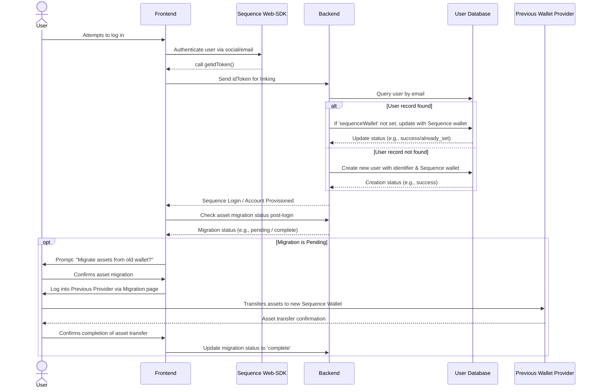

## 概要
このドキュメントは、thirdweb や Venly など他のプロバイダーから Sequence Embedded Wallets への移行ガイドです。推奨される主な方法は「ジャストインタイム（JIT）マイグレーションパターン」であり、これはユーザーが移行後に初めてログインした際に実行されます。

<CardGroup>
  <Card title="thirdweb から Sequence への移行" icon="book" href="/solutions/wallets/developers/embedded-wallet/migration#migrating-from-thirdweb-to-sequence">
    thirdweb In-App Wallets から Sequence への移行方法については、このガイドをご参照ください。
  </Card>
</CardGroup>

## 推奨される移行手順
移行プロセスは、既存のウォレットプロバイダーからSequence Embedded Walletsへのスムーズな移行を実現し、ユーザー体験への影響を最小限に抑えるよう設計されています。私たちのWeb-SDKは内部でwagmiメソッドを利用しているため、ほとんどの既存のアプリケーションロジックはそのまま互換性があります。このプロセスは、移行が実施された後にユーザーが初めてログインした際に自動的に行われ、一般的には次のような流れになります。



1.  **ユーザー認証**
    - ユーザーがログインしようとすると、Sequence SDKを使って希望するソーシャルプロバイダーやメールで認証を行います。
    - ユーザーが認証されると、メールアドレスやその他の一意のユーザー識別子とSequenceウォレットアドレスなどのユーザーデータがバックエンドに渡されます。

    Sequence SDKからSequence専用の`idToken`を取得し、それをバックエンドに渡すことで、ユーザーのメールアドレスやアドレスをバックエンド側で確認し、紐付けることができます。

    [こちら](https://docs.sequence.xyz/sdk/headless-wallet/verification)のガイドで、フロントエンドからトークンをリクエストし、バックエンドで検証する方法をご覧いただけます。

2.  **データベースの照合と更新**
    バックエンドで認証情報が確認できたら、ユーザーデータベースを修正し、そのユーザーにSequenceウォレットが既に存在するかどうかを管理できるようにします。
    - ユーザーデータベースに`sequenceWallet`カラムを追加します。
    - データベースは一意なユーザー識別子で検索され、該当ユーザーのレコードを取得します。
    - システムは、そのユーザーに'sequenceWallet'が既に存在するかどうかを確認します。存在する場合は、特に何も行いません。
    - Sequence ウォレットアドレスが見つからない場合：
      a. 渡された Sequence ウォレットを`sequenceWallet`カラムに挿入します。
    - データベースにユーザーが存在しない場合は、渡された情報を新規ユーザーとして登録します。

3.  **資産の移行**
    - ユーザーが正常にログインした後、資産の移行が既に行われているかシステムが確認します。
    - 存在しない場合は、旧ウォレットから新しいSequenceウォレットへ資産を移行する必要があることをユーザーに説明する案内が表示されます。
    - ユーザーは一度だけ、特定の移行ページから以前のプロバイダーにログインし、希望する資産を新しいSequenceウォレットへ移動します。
    - 資産移行をスムーズに行うため、Sequence の Indexer を使って関連資産とその数量をユーザーに表示することをおすすめします。

もし移行方法が大きく異なる場合は、ご質問があればお気軽にご連絡ください。

以下に、特定のプロバイダーからの移行ガイドをまとめています。

# thirdweb から Sequence への移行方法

## ユーザー認証
Thirdweb は独自のプロバイダーや認証方法を提供しています。移行を始めるには、これらがコードベースのどこで使われているかを特定することが重要です。

これらの場所が分かれば、Sequenceへ切り替えることができるようになります。

### Sequenceの依存関係のインストール

```bash pnpm
npm install @0xsequence/connect wagmi ethers@6.13.0 viem 0xsequence @tanstack/react-query
# or
pnpm install @0xsequence/connect wagmi ethers@6.13.0 viem 0xsequence @tanstack/react-query
# or
yarn add @0xsequence/connect wagmi ethers@6.13.0 viem 0xsequence @tanstack/react-query
```

### thirdweb プロバイダーから Sequence プロバイダーへの移行方法

<CodeGroup>
  ```diff diff

  - import { ThirdwebProvider } from "thirdweb/react";
  + import React from "react";
  + import ReactDOM from "react-dom/client";
  + import "./index.css";

  + import App from "./App";
  + import { config } from "./config";
  + import { SequenceConnect } from "@0xsequence/connect";

  function MainLayout() {
    return (
  -		<ThirdwebProvider>
  +			<SequenceConnect config={config}>
  +				<App />
  +			</SequenceConnect>
  -		</ThirdwebProvider>
    );
  }
  ```

  ```ts MainLayout.tsx
  import React from "react";
  import ReactDOM from "react-dom/client";
  import "./index.css";

  import App from "./App";
  import { config } from "./config";
  import { SequenceConnect } from "@0xsequence/connect";

  function Dapp() {
    return (
      <SequenceConnect config={config}>
        <App />
      </SequenceConnect>
    );
  }

  ReactDOM.createRoot(document.getElementById("root")!).render(
    <React.StrictMode>
      <Dapp />
    </React.StrictMode>
  );
  ```
</CodeGroup>

これで thirdweb のログイン機能を Sequence のログイン機能に置き換える準備ができました。これにより、ユーザーがログインすると自動的に Embedded Wallet が作成されます。

### thirdweb のログイン機能から Sequence のログイン機能への移行

<CodeGroup>
  ```diff diff
  - import { ConnectButton } from "thirdweb/react";
  - import { client } from "../client";
  + import { useOpenConnectModal } from '@0xsequence/connect'

  export function Landing() {
  + const { setOpenConnectModal } = useOpenConnectModal()
    
    return (
  -   <ConnectButton client={client} />
  +   <button onClick={() => setOpenConnectModal(true)}>Connect</button>
    )
  }
  ```

  ```ts Connect.tsx
  import { useOpenConnectModal } from '@0xsequence/connect'

  export function Landing() {
    const { setOpenConnectModal } = useOpenConnectModal()
    
    return (
      <button onClick={() => setOpenConnectModal(true)}>Connect</button>
    )
  }
  ```
</CodeGroup>

移行体験に特化した内容については、[専用のサンプルリポジトリ](https://github.com/0xsequence-demos/embedded-wallet-migration)もご用意しています。これにより、ユーザーは自身のNFTを確認したり、チェーンを切り替えたり、thirdweb アカウントから他のウォレットへ資産を移動できます。

Sequenceの統合を一から始める場合は、以下のいずれかのリポジトリをプロジェクトのベースとしてご利用いただけます。
-   [React Boilerplate](https://github.com/0xsequence-demos/kit-embedded-wallet-react-boilerplate) – Sequence Embedded Walletが組み込まれたReactベースのスタータープロジェクトです。

-   [Next.js Boilerplate](https://github.com/0xsequence-demos/kit-embedded-wallet-nextjs-boilerplate) – Sequence Embedded Walletが組み込まれたNext.jsベースのスタータープロジェクトです。

どちらもSequence Embedded Walletの統合が最初から完了しています。

また、Web-SDK経由でSequence固有の設定変数をセットする必要があります。詳細は[こちら](https://docs.sequence.xyz/sdk/web/wallet-sdk/embedded/getting-started#setting-up-your-dapp)をご覧ください。

ユーザーが認証されたら、SequenceのidTokenをリクエストし、この[ガイド](https://docs.sequence.xyz/sdk/web/wallet-sdk/embedded/guides/verification)に従ってバックエンドに渡してください。

ここから先は、バックエンドやユーザーデータベースに応じて[ステップ2](https://docs.sequence.xyz/solutions/wallets/developers/embedded-wallet/migration#recommended-migration-process)に進み、ユーザーの移行状況を追跡してください。

最後に、ユーザーが Sequence ウォレットを取得し、バックエンド側でもステータスの追跡ができるようになったら、専用のマイグレーションページで資産移行を促してください。ユーザーは thirdweb の認証情報でログインし、資産を Sequence ウォレットへ移すことで移行が完了します。