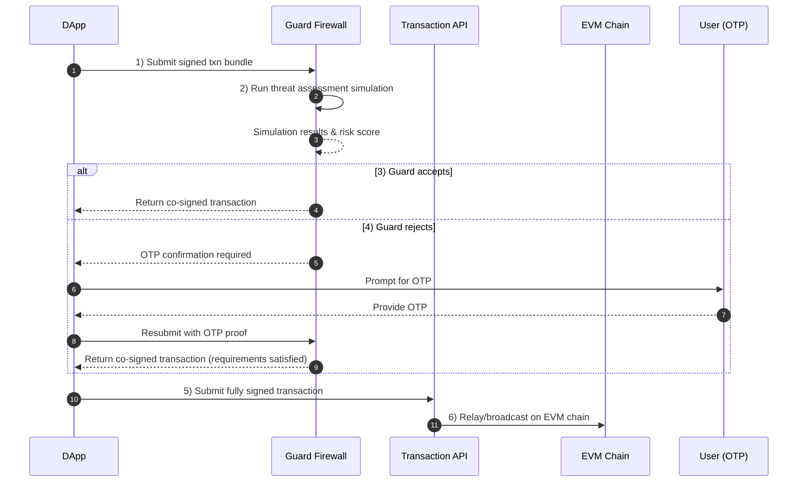
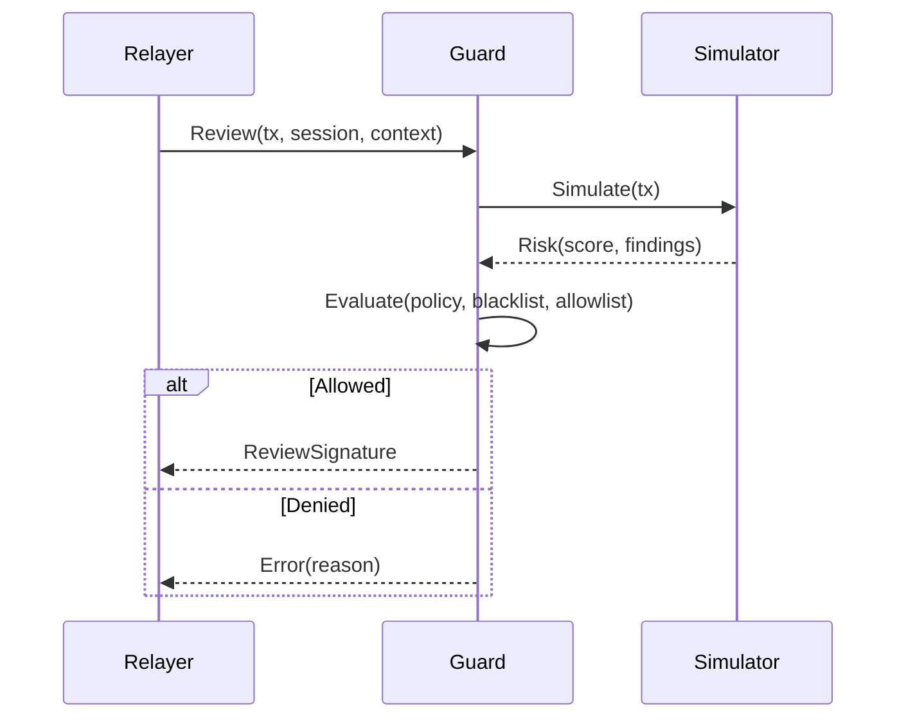

**Guard Firewall** は、Sequenceが運用するレビューサイナーで、トランザクションがオンチェーンに送信される前に評価を行います。エコシステムのポリシーを強制し、サードパーティ連携による脅威シミュレーションを実施し、**ガード署名**を付与または保留することでトランザクションを許可またはブロックします。エコシステム管理者は悪意のあるアプリやコントラクトの**ブラックリスト**も管理できます。

## ポリシーモデル
ポリシーはエコシステムごとに設定でき、以下を含みます：
- **アプリ登録とブラックリスト**：登録済みアプリ／オリジンのみ送信可能。管理者はdappやコントラクトをブラックリスト化できます。
- **リスク閾値**：シミュレーターが返すリスクスコアが閾値を超えたトランザクションをブロックします。
- **メソッド・コントラクト許可リスト**：呼び出せるコントラクトや関数セレクタを制限します。
- **支出上限とトークンルール**：トークン、受取人、アプリごとに一定期間内の送金上限を設定します。
- **緊急停止スイッチ**：すべて、または特定範囲のトランザクションをブロックするフェイルクローズドモード。

## 脅威シミュレーション
Guardはトランザクションのペイロード（calldata、value、状態差分）に対してリアルタイムで脅威分析を行います。エコシステムの設定に基づき、Guardはポリシー閾値を適用し、署名または拒否、またはOTP認証を要求します。

## ブラックリスト管理

- 管理者はアプリ、オリジン、コントラクトをブラックリストに追加できます。ブラックリストは優先され、即時に拒否されます。
- リストはGuardに伝播され、短いTTLでキャッシュされます。更新はほぼリアルタイムです。

## 運用上の注意点

- **フェイルクローズド**：Guardに接続できず、レビュー署名が必要な場合はトランザクションがブロックされます。
- **監査性**：判断は入力（ハッシュ）、シミュレーターの応答、ポリシーバージョン、理由コードとともに記録されます。
- **パフォーマンス**：キャッシュやインクリメンタルシミュレーションにより遅延を抑制。タイムアウト時はデフォルトで拒否し、バイパスを防ぎます。

## 導入ガイダンス

- セッションやウォレットポリシーで**Guard署名**を必須にし、レビューをバイパスできないようにしてください。
- エコシステム管理画面でアプリやオリジンを登録し、ポリシーやリスク閾値を設定しましょう。
- ブラックリストを常に最新に保ち、インシデント情報に迅速に対応してください。