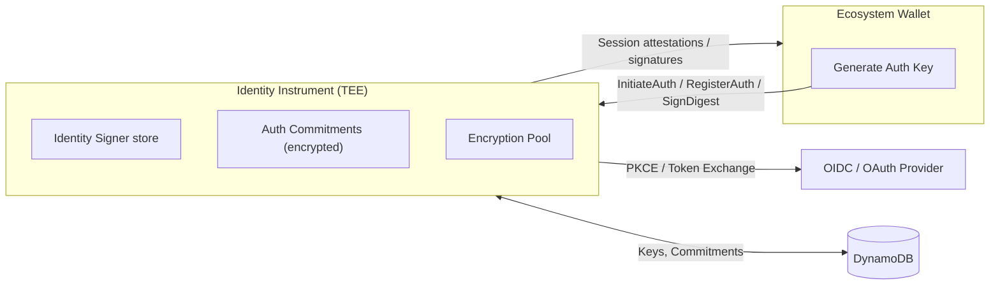
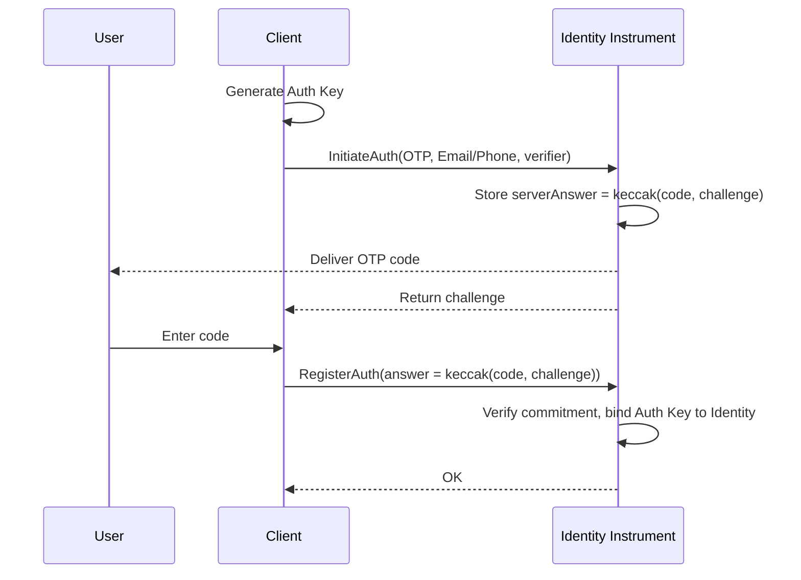
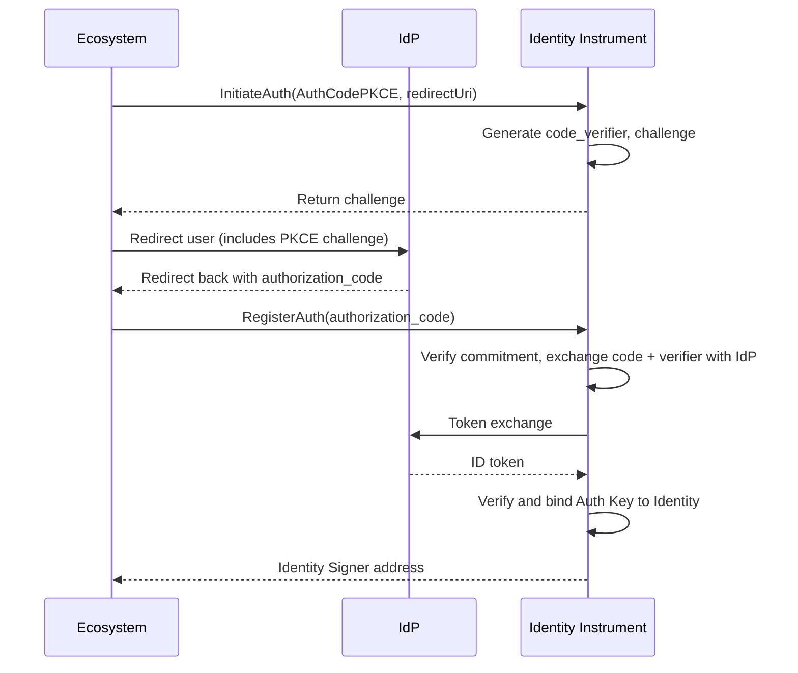

**Identity Instrument** はAWS Nitro EnclavesのTEE（信頼実行環境）上で動作するサービスで、メール／電話によるOTP認証またはOIDC互換のIDプロバイダー（GoogleやAppleなど）による認証を行います。認証されたユーザーにデバイス生成の**Auth Key**を紐付け、**Identity Signer**でセッション証明書やダイジェストに署名します。アプリケーションがIdPクライアントシークレットを直接扱うことはなく、Identity Instrumentが仲介し最終的な署名を発行します。

## Architecture
以下はIdentity Instrumentのハイレベルなアーキテクチャ図です。

## 暗号学的アテステーション
Identity InstrumentはEIF（Enclave Image File）として公開GitHubリリースからデプロイされます。EIFはコードベースから決定的にビルドされ、すべてのコードから**メジャメント**（測定値）が導出されます。特定のコミットでビルドすれば常に同じ測定値になります。

これらの測定値はAWS Nitroシステムによって**アテスト**され、記述されたビルドに対して有効であることが保証されます。これは**暗号学的アテステーション**と呼ばれる文書でAWSのPKI（公開鍵基盤）で署名され、誰でも検証できます。

アテステーションはAWS KMSへのすべてのリクエストに含まれ、その有効性が検証されます。信頼できる第三者（KMSキーの管理を担う組織）は、正しいEIFがデプロイされている場合のみキーにアクセスできるようKMSキーのポリシーを設定します（測定値で識別）。

Identity Instrumentからのすべてのレスポンスには、HTTPヘッダー`X-Attestation-Document`にアテステーションが含まれます。これらにより、Identity Instrumentの安全性と**公開検証性**が保証されます。

## 認証モード
Identity Instrumentは2つの認証モードをサポートしています：
- OTP認証（メール／電話）
- OAuth AuthCode with PKCE（エコシステム経由）

### OTP認証（メール／電話）
`OTP`認証モードでは、ユーザーが指定した宛先にランダム生成のコードを直接送信します。その宛先がAuth Keyと紐付けられるIDとなります。コードの送信方法はIDタイプ（例：メール、SMSなど）によりますが、フロー自体は共通です。

Identity Signerは宛先（メールアドレス、電話番号など）に基づき取得または作成されます。

### OAuth AuthCode with AuthCodePKCE
AuthCodePKCE認証モードは、OAuth2の「認可コードフロー」を使い、外部IDプロバイダーからユーザープロファイルを取得します。PKCE拡張を利用することで、クライアントがクライアントシークレットを持っていても認可コードを交換できません。これはIdentity InstrumentがランダムなCode Verifierを生成・安全に保管し、そのハッシュ（Code Challenge）を使ってIdP認証を開始することで実現します。トークンリクエスト時にIdentity Instrumentが元のCode Verifierを送信し、IdPは初回リクエストと同じハッシュ値か検証するため、Identity Instrument以外が開始した場合はトークン交換できません。

## 暗号化プール
Identity Instrumentはデータ（サイナーのEOA秘密鍵など）をAES-256-CBCで暗号化し、グローバルな暗号鍵プールからランダムに選ばれた秘密鍵を使います。各暗号鍵はShamirの秘密分散法で3分割され、復号には最低2つの分割片が必要です。各分割片は異なるAWS KMS暗号鍵で暗号化され、Identity Instrumentのデータベースには暗号文のみが保存されます。

KMS鍵のうち2つはSequenceと無関係な別組織（Trusted Third Parties）が所有・管理し、残り1つはSequence自身が管理します。

つまり、各サイナー秘密鍵は2/3のリモート鍵構成で保護され、単一の組織がデータへアクセスできません。同時に、Trusted Third Partyの1つが失われても、他2つが稼働していればシステムやデータは失われません。

## セキュリティ特性

- アプリケーションはIdPクライアントシークレットを受け取らず、交換はエンクレーブのみが実施します。
- PKCEによりOAuthリダイレクト時のコード傍受を防ぎます。
- エンクレーブのアテステーションにより、エコシステムは正しいサービスバイナリと通信していることを検証できます。
- 鍵のローテーションや設定移行はプール世代によりダウンタイムなしで対応可能です。

## 参考情報

- [Identity Instrument Githubリポジトリ](https://github.com/0xsequence/identity-instrument)
- [TEE Verifier（TypeScript）](https://github.com/0xsequence/tee-verifier.js)
- [TEE Verifier（Go）](https://github.com/0xsequence/tee-verifier)