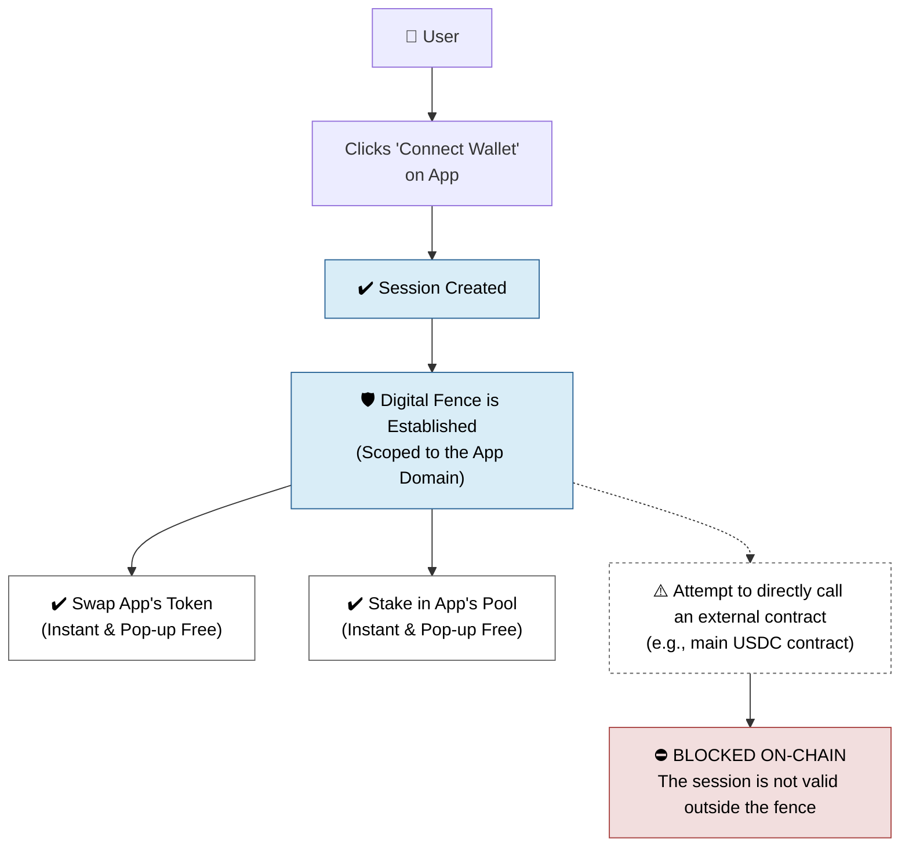
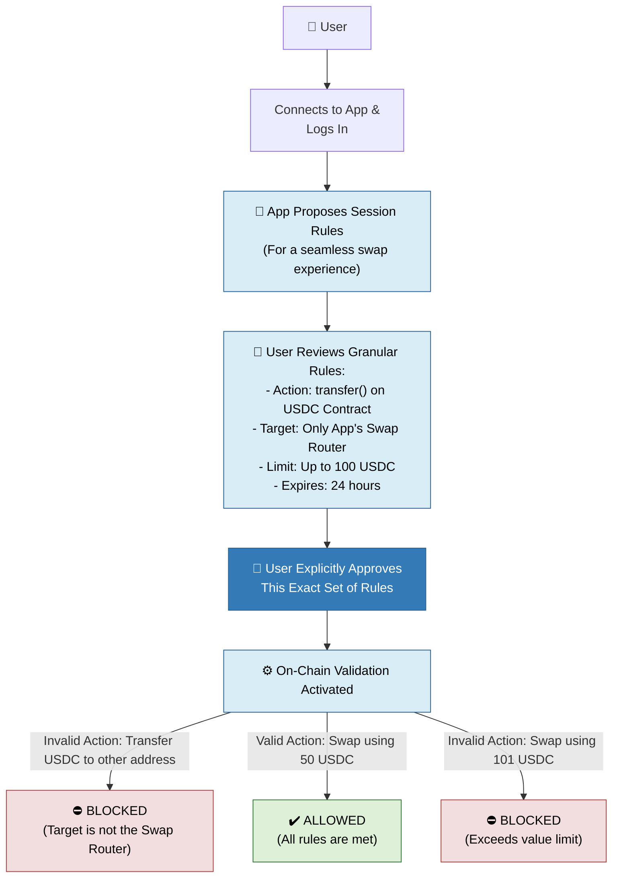

## 現在のWeb3 UXの課題
現在のWeb3では、ユーザー体験が頻繁に中断されます。スワップ、出品、ちょっとした操作のたびにウォレットのポップアップが表示され、「署名」や承認を求められます。これが摩擦となり、日常的に使うスムーズなアプリと比べて使いづらさを感じさせます。

## Smart Sessionsとは？
**Smart Sessionsは、この課題を解決する仕組みです。**

Smart Sessionは、アプリに一時的かつ厳密に制限された権限を安全に付与する仕組みです。毎回トランザクションを承認する代わりに、一度セッションを承認すれば、アプリが事前に合意した範囲の操作を代理で実行できます。これにより、頻繁なポップアップがなくなり、セキュリティや自己管理を損なうことなく、Web2のようなスムーズな体験が実現します。

> 💡 **イメージしやすく言えば：** メインのウォレット署名鍵（マスターキー）を丸ごと渡すのではなく、明確なルールと制限が付いた特別なキーカードをアプリに渡すようなものです。

## 2種類のSmart Sessions
Sequenceは、用途に応じて2種類のSmart Sessionsを提供しています。
- **インプリシットセッション:** 単一の信頼できるアプリ内で最大限の利便性を提供します。
- **Explicit Sessions：** あらゆるオンチェーン操作に対する強力かつ細かな制御向け。

---

## 1. Implicit Sessions：「アプリ内利便パス」
インプリシットセッションは、最もシンプルで一般的なSmart Sessionの形態です。主な目的は、単一アプリ内での体験をできるだけスムーズにすることです。

### 🎯 基本コンセプト
信頼できるアプリに接続すると、そのアプリのウェブサイトドメインを囲む「信頼の境界」が作られます。インプリシットセッションは、そのアプリ内だけで自由に操作できる権限を与えます。

### ⚙️ 仕組み

1. **接続＆信頼:** ウォレットをアプリ（例：`app.my-defi-protocol.com`）に接続します。
2. **サイレント承認：** セッションは自動的かつサイレントに、その特定ドメインに暗号的にロックされた状態で作成され、ユーザーの承認操作は不要です。
3. **シームレスな体験:** そのアプリ内では、スワップやステーキング、出品など、追加のポップアップなしであらゆる操作が可能です。すぐに使えます。

### 🔒 セキュリティの仕組み
このセッションは他の場所では無効です。もしアプリが悪意を持ってこのセッションで自分のドメイン外（例：USDCコントラクト）を呼び出そうとした場合、トランザクションは自動的にオンチェーンで拒否されます。セッションはアプリ自身のスマートコントラクトにのみ有効です。
アプリは[Sequence Builder](https://sequence.build)で権限を設定します。

### 📊 Implicit Sessionsのポイント

| 項目        | 詳細                                               |
| --------- | ------------------------------------------------ |
| **最適な用途** | 単一アプリの日常利用（DeFiプロトコル、マーケットプレイス、ゲームなど）            |
| **主な特徴**  | 最大限の利便性。信頼できるアプリ環境内で、すべての署名ポップアップを排除します。         |
| **たとえ話**  | 特定の建物専用のキーカード。建物内のすべての部屋を自由に移動できるが、隣の建物のドアは開かない。 |

---

## 2. Explicit Sessions：「プログラム可能な許可証」
Explicit Session（エクスプリシットセッション）は、より高度で強力なツールです。アプリが他の外部プロトコルと連携する、非常に特定のタスクを実行する必要がある場合に設計されています。

### 🎯 基本コンセプト
単にアプリ全体やそのスマートコントラクトを信頼するのではなく、一時的な署名者に対して、正確なルールのリストを承認します。どこで、何が、どれだけ、どの期間、どのコントラクトに対して実行できるかを明確に指定したカスタムの許可証を作成するイメージです。

### ⚙️ 仕組み

1.  **アプリが「契約」を提案:** アプリが、あなたのウォレットに対して必要な非常に具体的な権限のリストを提示します。例えば：
    - 「`USDCコントラクト`の`transfer`関数を呼び出すことを許可してください。」
    - 「…`recipient`アドレスは`0x...`のみ」
    - 「…合計で最大`100`USDCまで」
    - 「…この権限は`24時間`で失効します。」

2.  **ユーザーが明示的にルールを承認：** ウォレットがこれらのルールを人間が読める形で表示します。ユーザーは内容を確認し、この条件セットを承認します。

3.  **アプリが実行:** アプリはこれらのアクションを自動で実行でき、ポップアップは一切表示されません。

### 🔒 セキュリティの仕組み
Explicit Sessionの強みは、その細かな制御にあります。各ルールはオンチェーンで検証されます。もしアプリが承認された範囲外、例えば100 USDCではなく101 USDCを使おうとしたり、`transfer`ではなく`approve`関数を呼び出そうとした場合、トランザクションは失敗します。

### 📊 Explicit Sessionsのポイント

| 項目        | 詳細                                                                                             |
| --------- | ---------------------------------------------------------------------------------------------- |
| **最適な用途** | 特定の自動化・高額操作の承認（例：自動イールド収穫、NFT入札、定期支払い設定）やポップアップゼロ体験                                            |
| **主な特徴**  | 細やかでプログラム可能なコントロール。アプリに許可する範囲を、あなた自身が正確に定義できます。                                                |
| **たとえ話**  | 事前承認済みの小切手のようなもの。特定の相手（target）に、正確な金額（valueLimit）で、「入金専用」などのメモ（rules）付きで発行。銀行はこれらのルールを厳格に守ります。 |

### 多様な統合方法
2種類のセッションを組み合わせて、両方の利点を活かすことができます。Implicit Sessionのスコープ外に出ると、Sequence SDKは自動的に単一トランザクション承認状態に切り替わり、EOAのように動作します。Implicit Session外で繰り返し操作が必要な場合は、Explicit Sessionをリクエストしてシームレスに統合できます。