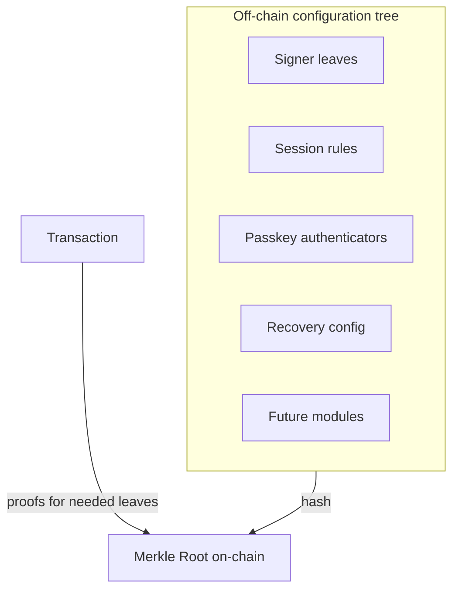
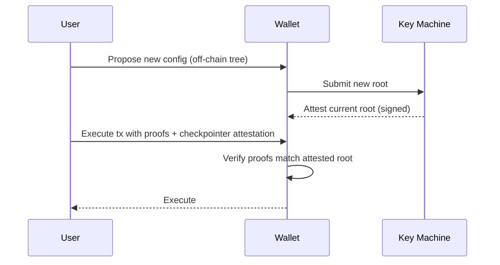

Ecosystem Walletsはオンチェーンに単一の**マークルルート**を保存し、ウォレット設定全体（サイナー、重み、閾値、パスキー認証、Smart Sessionルール、リカバリーメカニズム、将来の拡張）をコミットします。各アクションは、実行時に必要な設定部分を検証する**マークル証明**を提供します。

## Model

- **Root**：ウォレットコントラクトは1つのハッシュルートを保存します。
- **Leaves**：サイナー、セッション、リカバリー、パスキー、モジュールのための型付きレコードです。
- **Extensions**：モジュールは特定のリーフタイプ（例：セッション管理、パスキー）を解釈します。
- **Proofs**：実行時に必要なリーフ（例：署名者の重み、セッションルール）のためのMerkle証明を提供します。

## 設定の更新
設定の更新（デバイス追加、セッション制限の変更、鍵のローテーション）はオフチェーンで新しいツリーとルートを計算して行います。**Key Machine**サービスが最新のルートを証明し、トランザクションはこの証明を含めるか参照できるため、ウォレットは常に最新の設定のみを受け入れます。

## スマートセッションとパスキー

- **スマートセッション**：リーフでセッションキーのスコープ（許可されたコントラクト／関数、支出上限、有効期限など）を定義します。実行時にセッションキーとルール証明を検証し、アクションを許可します。
- **パスキー**：パスキー認証器はリーフとして管理され、デバイスが生成するWebAuthn署名を、パスキー拡張機能が該当リーフ証明を使って検証します。

## リカバリー

- **時間制限付きリカバリーキー**：リカバリーリーフはタイムロック期間をエンコードします。リカバリー開始時にカウントダウンが始まり、その間は既存の署名者がキャンセル可能です。期限後、リカバリーキーで主要署名者をローテーションできます。

## 効率性

- オンチェーンに保存されるのはルートのみで、必要なときに証明をcalldataとして提供します。
- パッキングやビットマップ技術により、マルチシグや複数証明の場合でもcalldataを最小限に抑えます。

## クロスチェーンの一貫性

- 同じルートがウォレットの全チェーンを管理します。チェックポインターの証明により、各ネットワークは正規のルートのみを受け入れ、古い設定によるリプレイを防ぎます。

## 参考情報

- [ウォレットコントラクト](https://github.com/0xsequence/wallet-contracts-v3)