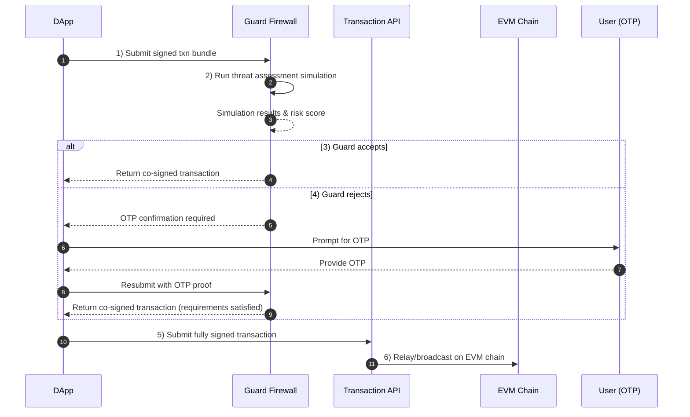
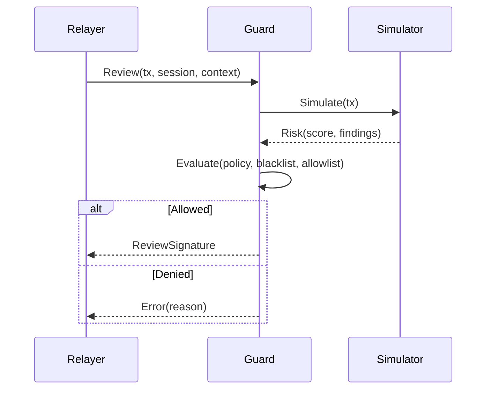

**Guard Firewall** is a Sequence-operated review signer that evaluates transactions before they are sent on-chain. It enforces ecosystem policies, performs threat simulations via third-party integrations, and can block or allow transactions by signing or withholding a **guard signature**. Ecosystem admins can also maintain **blacklists** of malicious apps or contracts.

## Policy model

Policies are configured per ecosystem and can include:

- **App registration and blacklists**: only registered apps/origins may submit; admins can blacklist dapps or contracts.
- **Risk thresholds**: block transactions that exceed a risk score returned by the simulator.
- **Method and contract allowlists**: restrict which contracts and function selectors can be called.
- **Spend limits and token rules**: cap per-interval outflows by token, recipient, or app.
- **Emergency kill switch**: fail-closed mode that blocks all or specific scopes.

## Threat simulation

Guard can perform real-time threat analysis on the transaction payload (calldata, value, state deltas). Based on the ecosystem configuration, Guard applies policy thresholds and signs or denies the transaction, or requires OTP confirmation.

## Blacklist controls

- Admins can blacklist apps, origins, or contracts. Blacklists take precedence and cause immediate denials.
- Lists are propagated to the Guard and cached with short TTL; updates are near-real-time.

## Operational notes

- **Fail-closed**: if the Guard is unreachable and policy requires a review signature, transactions are blocked.
- **Auditability**: decisions are logged with inputs (hashes), simulator responses, policy version, and reason codes.
- **Performance**: caching and incremental simulation are used to keep latency low; timeouts default to deny to avoid bypass.

## Implementation guidance

- Require a **Guard signature** in your session or wallet policy so transactions cannot bypass review.
- Register apps and origins in your ecosystem admin, define policies, and set risk thresholds.
- Keep blacklists curated and respond quickly to incident intel.
