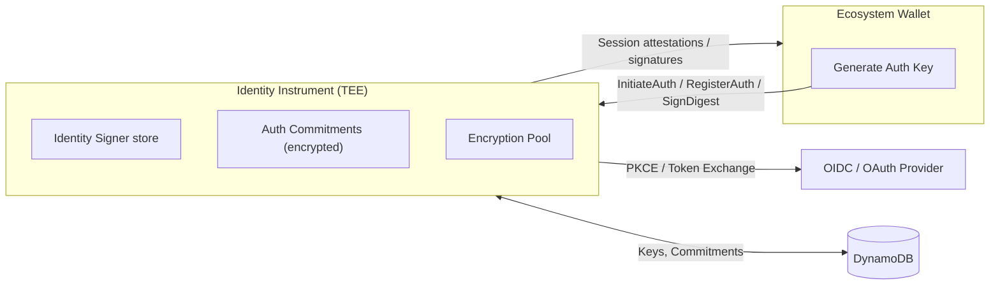
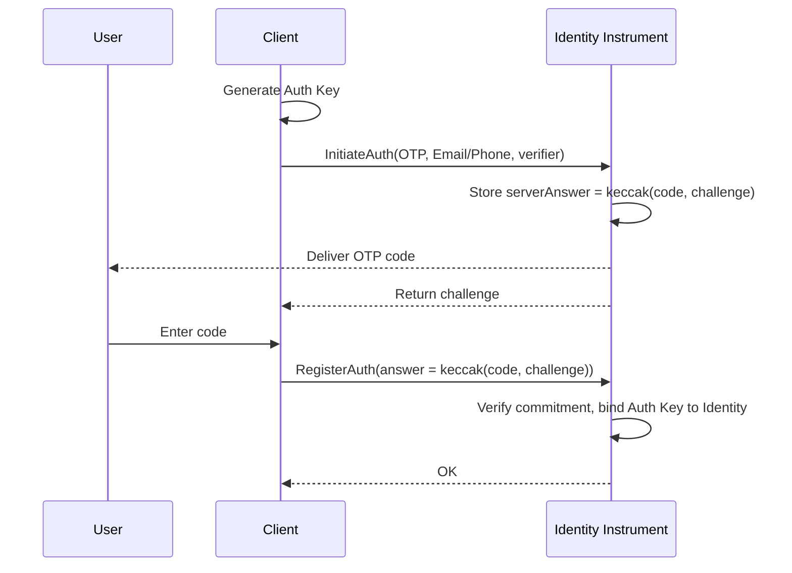
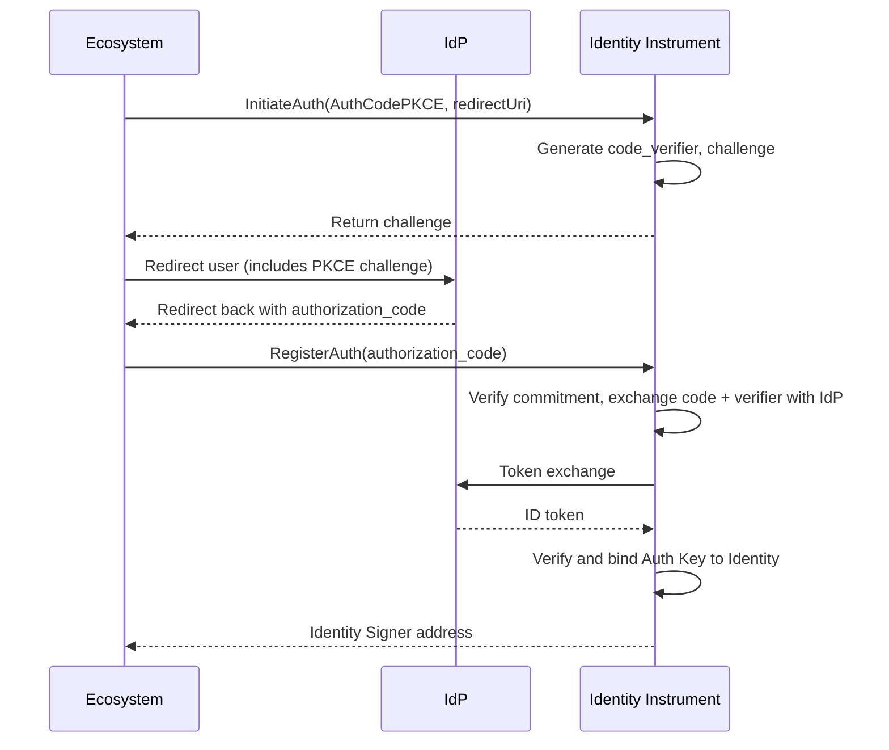

**Identity Instrument** is an enclave-backed service (TEE in AWS Nitro Enclaves) responsible for authenticating users with either email/phone confirmation via OTP or an OIDC-compatible identity provider (IdP, such as Google or Apple). It binds a device-generated **Auth Key** to the authenticated user, and uses an **Identity Signer** to sign session attestations or digests. Applications never handle IdP client secrets directly; the Identity Instrument mediates the exchange and issues the final signature.

## Architecture

Below is a high-level architecture diagram of the Identity Instrument.

## Cryptographic Attestation

Identity Instrument is deployed from an EIF (Enclave Image File) published as a public GitHub release. An EIF is built deterministically from the codebase and a set of **measurements** are derived from all the code included in the build. This means that a build at a specific commit will always produce the same measurements.

These measurements are **attested** by the AWS Nitro system that ensures that they are valid for the exact built that they describe. This is done with a document called **cryptographic attestation** that is signed by the AWS PKI (Public Key Infrastructure), it can be validated by anyone.

The attestation is included in every request to AWS KMS that verifies its validity. Trusted Third Parties (entities tasked with managing the KMS keys used to encrypt Identity Instrument data) set up the KMS keys with policies that only allow access to the key if the correct EIF is deployed, identified by its measurements.

Every response from Identity Instrument contains the attestation in the HTTP header `X-Attestation-Document`. All of the above combines to ensure that Identity Instrument is secure and **publicly verifiable**.

## Authentication modes

Identity Instrument supports two authentication modes:

- OTP Auth (email/phone)
- OAuth AuthCode with PKCE (ecosystem mediated)

### OTP Auth (email/phone)

The `OTP` authentication mode is used to send a randomly generated Code directly to the destination specified by the User. That destination becomes the identity with which the Auth Key is associated. The way the Code is sent depends on the Identity Type used (e.g. email message, text message, etc.) but in every case the flow remains the same.

The Identity Signer is retrieved or created based on the destination (email address, phone number, etc.)

### OAuth AuthCode with AuthCodePKCE

The AuthCodePKCE authentication mode uses the OAuth2 "Authorization Code Flow" to retrieve user profile from an external Identity Provider. By utilizing the Proof of Key Code Exchange (PKCE) OAuth2 extension, the Client is never able to exchange the authorization code, even if it's in possession of the Client Secret. This is enforced by a random Code Verifier that is generated and stored securely by Identity Instrument. Its hash, called Code Challenge, is used by the Client to start the IdP authentication process. The original Code Verifier is sent by Identity Instrument with the token request. The Identity Provider ensures that it hashes to the same value as sent in the initial request, preventing token exchange if the process wasn't initiated by Identity Instrument.

## Encryption Pool

Identity Instrument encrypts its data (such as signer EOA private keys) using AES-256-CBC with private keys selected randomly from a global cipher key pool. Each of these cipher (encryption) keys is split into 3 parts using Shamir's secret sharing, requiring a minimum of 2 parts in order to decrypt a given cipher key. Each part is then encrypted using a different remote AWS KMS encryption key. Only the resulting ciphertexts are stored in Identity Instrument's database.

Two of the KMS keys are owned and controlled by separate Trusted Third Parties - organizations unaffiliated with Sequence. The third KMS is owned and controlled by Sequence itself.

This means that in the end each signer private key is secured by a 2/3 remote key setup where no single entity has access to the data. At the same time, losing a Trusted Third Party doesn't compromise the system nor lead to data loss, provided the other 2 TTPs are still active.

## Security properties

- Applications never receive IdP client secrets; only the enclave performs the exchange.
- PKCE prevents code interception during OAuth redirects.
- Enclave attestation lets ecosystems verify they are talking to the correct service binary.
- Key rotations and config migrations are supported without downtime via the pool generations.

## References

- [Identity Instrument Github Repo](https://github.com/0xsequence/identity-instrument)
- [TEE Verifier (TypeScript)](https://github.com/0xsequence/tee-verifier.js)
- [TEE Verifier (Go)](https://github.com/0xsequence/tee-verifier)
