## The Problem with Web3 UX Today

In Web3 today, the user experience is often interrupted. Every swap, every listing, every minor action requires a wallet pop-up, forcing you to "sign" and approve. This creates friction and makes apps feel clunky compared to the smooth apps we use every day.

## What Are Smart Sessions?

**Smart Sessions is a solution to this problem.**

A Smart Session is a secure, temporary, and strictly limited set of permissions that you grant to an app. Instead of approving every single transaction, you approve a session once, allowing the app to perform a range of pre-agreed actions on your behalf. This eliminates constant pop-ups and unlocks a fluid, Web2-like experience without sacrificing security or self-custody.

> 💡 **Think of it this way:** It's less like handing over your master key (your main wallet signer) and more like giving an application a special-purpose keycard with very clear rules and limitations.

## Two Types of Smart Sessions

Sequence offers two distinct types of Smart Sessions, each designed for a different purpose:

- **Implicit Sessions:** For ultimate convenience within a single, trusted app.
- **Explicit Sessions:** For powerful, granular control over any on-chain action.

---

## 1. Implicit Sessions: The "In-App Convenience Pass"

An Implicit Session is the simplest and most common type of Smart Session. Its entire purpose is to make your experience inside a single app as smooth as possible.

```mermaid
flowchart TD
    U[👤 User] --> C["Clicks 'Connect Wallet'<br/>on App"]
    C --> S["✔️ Session Created"]
    S --> F["🛡️ Digital Fence is Established<br/>(Scoped to the App Domain)"]

    F --> SW["✔️ Swap App's Token<br/>(Instant & Pop-up Free)"]
    F --> ST["✔️ Stake in App's Pool<br/>(Instant & Pop-up Free)"]
    F -.-> EC["⚠️ Attempt to directly call an external contract<br/>(e.g., main USDC contract)"]
    EC --> B["⛔ BLOCKED ON-CHAIN<br/>The session is not valid outside the fence"]

    style F fill:#d9edf7,stroke:#2a6496,stroke-width:1px,color:#000
    style S fill:#d9edf7,stroke:#2a6496,stroke-width:1px,color:#000
    style SW fill:#fff,stroke:#666,color:#000
    style ST fill:#fff,stroke:#666,color:#000
    style EC fill:#fff,stroke:#666,stroke-dasharray: 3 3,color:#000
    style B fill:#f2dede,stroke:#a94442,stroke-width:1px,color:#000
```

### 🎯 The Core Idea

When you connect to an app you trust, you are creating a "trust boundary" around that app's website domain. An Implicit Session gives that app a pass to operate freely only within its own walls.

### ⚙️ How It Works

1. **Connect & Trust:** You connect your wallet to an app (e.g., `app.my-defi-protocol.com`)
2. **Silent Approval:** A session is automatically and silently created that is cryptographically locked to that specific domain without the user having to approve it.
3. **Seamless Experience:** You can now perform any action inside that app, swapping, staking, listing, without any further pop-ups. It just works.

### 🔒 The Security Guardrail

This session is useless anywhere else. If the app was malicious and tried to use this session to call a contract outside its domain (like the USDC contract), the transaction would be automatically rejected on-chain. The session is only valid for the app's own smart contracts.
The app will configure the permissions in the [Sequence Builder](https://sequence.build)

<Warning>
All transactions must be sponsored by the DApp itself when using Implicit Sessions since using any other currency as a fee option is treated as an external contract interaction and will be blocked.
</Warning>

### 📊 Implicit Sessions at a Glance

| Aspect | Details |
|--------|---------|
| **Best For** | Day-to-day use of a fully gas sponsored DApp, 0 pop-ups, with no need for external contract interactions. |
| **Key Feature** | Maximum convenience. Eliminates all signing pop-ups within a trusted app environment |
| **Analogy** | A keycard for a specific building. It lets you move freely between all the rooms inside, but it won't open the door to the building next door. |
| **Drawback:** | The DApp has to sponsor the gas fees for all transactions and it cannot interact with any external smart contract, locked to the app's own smart contracts. |

---

## 2. Explicit Sessions: The "Programmable Permission Slip"

An Explicit Session is a more advanced and powerful tool. It's designed for when an app needs to perform very specific tasks that interact with other external protocols.

```mermaid
flowchart TD
    U[👤 User] --> C["Connects to App &<br/>Logs In"]
    C --> P["📄 App Proposes Session Rules<br/>(For a seamless swap experience)"]
    P --> R["📝 User Reviews Granular Rules:<br/>- Action: transfer() on USDC Contract<br/>- Target: Only App's Swap Router<br/>- Limit: Up to 100 USDC<br/>- Expires: 24 hours"]
    R --> A["🙋 User Explicitly Approves<br/>This Exact Set of Rules"]
    A --> V["⚙️ On-Chain Validation Activated"]

    V -->|Invalid Action: Transfer USDC to other address| B1["⛔ BLOCKED<br/>(Target is not the Swap Router)"]
    V -->|Valid Action: Swap using 50 USDC| OK["✔️ ALLOWED<br/>(All rules are met)"]
    V -->|Invalid Action: Swap using 101 USDC| B2["⛔ BLOCKED<br/>(Exceeds value limit)"]

    style P fill:#d9edf7,stroke:#2a6496,stroke-width:1px,color:#000
    style R fill:#d9edf7,stroke:#2a6496,stroke-width:1px,color:#000
    style A fill:#337ab7,stroke:#2a6496,stroke-width:1px,color:#fff
    style V fill:#d9edf7,stroke:#2a6496,stroke-width:1px,color:#000
    style OK fill:#dff0d8,stroke:#3c763d,stroke-width:1px,color:#000
    style B1 fill:#f2dede,stroke:#a94442,stroke-width:1px,color:#000
    style B2 fill:#f2dede,stroke:#a94442,stroke-width:1px,color:#000
```

### 🎯 The Core Idea

Instead of trusting an app and its smart contracts only, you are approving a precise list of rules for a temporary signer that can interact with any smart contract. You are building a custom permission slip that says exactly what can be done, where it can be done, how much can be spent, for how long, and for which contracts.

### ⚙️ How It Works

1. **The app proposal:** The app presents your wallet with a list of very specific permissions it needs. For example:
   - "Allow me to call the `transfer` function on the `USDC contract`."
   - "... with the `recipient` address `0x...` only"
   - "...for a `cumulative` total of no more than `100` USDC."
   - "...for a duration of `24 hours`."

2. **You Explicitly Approve the Rules:** Your wallet displays these rules in a human-readable format. You review and approve this exact set of conditions.

3. **The app Executes:** The app can now perform those actions automatically, with 0 pop-ups.

### 🔒 The Security Guardrail

The power of Explicit Sessions comes from their granularity. Each rule is validated on-chain. If the app tries to do anything outside the approved scope, like spend 101 USDC instead of 100, or call the `approve` function instead of `transfer`, the transaction will fail.

### 📊 Explicit Sessions at a Glance

| Aspect | Details |
|--------|---------|
| **Best For** | Granular control over any action, not tied to your app's smart contracts only. |
| **Key Feature** | Granular, programmable control. You define the exact scope of what the app is allowed to do with no restrictions. |
| **Analogy** | A keycard that can work for many buildings but you have to first sign a contract defining the exact rules for each building, only then you can use it. |
| **Drawback:** | The user has to carefully review and approve the DApp's permissions adding 1 extra step in the UX. |

### Versatile Integrations

Best part is that you can combine the two types of sessions together to get the best of both worlds. Whenever you go out of scope on an Implicit Session, Sequence SDKs will automatically switch a single-transaction approval state, functioning like an EOA. For repeated actions outside of an Implicit Session, you can request an Explicit Session for a seamless integration.
