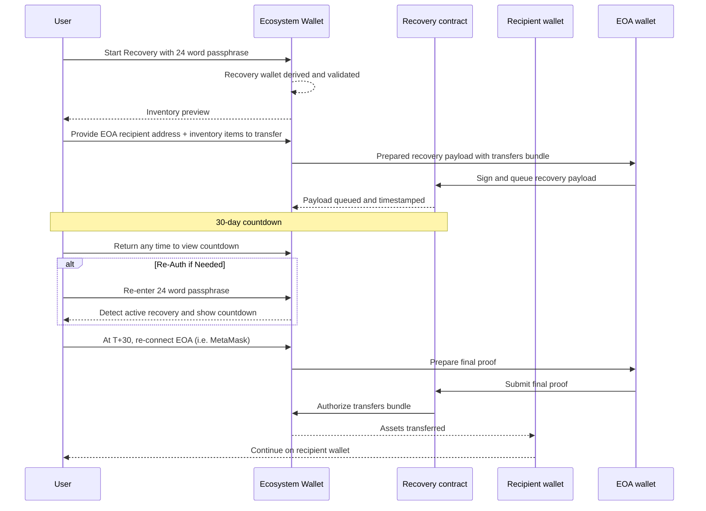

At recovery start, the user provides a recipient wallet address; the system queues a deterministic transfer bundle to move inventory to that recipient after the delay. Finalization is not automatic: once the countdown completes, the user returns and executes the queued transactions using an EOA wallet (for example MetaMask). The recovery request is visible on-chain. Watchtower emails the registered address throughout the window. If Sequence infrastructure is unavailable, recovery still works using the standalone recovery tool and session metadata replicated on Arweave.

## Design goals and security properties

- Enforced delay: Recovery cannot finalize before 30 days. This removes instant, silent takeover paths common with mnemonic-only backup and recovery modes.
- Deterministic effect: The queued payload is a fixed transfer plan to a user-specified recipient. Auditors and operators can pre-compute and monitor the exact outcome.
- On-chain observability: The queued request is public. Watchtower sends escalating email notifications to the recovery email.
- Sequence independence: Contracts are self-sufficient. Users can run the standalone recovery tool. Session metadata required by the client is continuously backed up to Arweave chain for permanent storage. The only requirement is that the target EVM chain must be live.

## Prerequisites and configuration

- 24-word recovery phrase: Created for the wallet via UI or SDK. Used only for recovery authorization.
- Recovery notifications email: Bound to the recovery key at mnemonic creation. Used by Watchtower.
- Optional encrypted digital backup: Store an encrypted form of the mnemonic in a reputable password manager (for example 1Password). Protect it with a memorized decryption password that is not stored with the encrypted blob.

## Recovery flow (user UX)

1) User is logged in, creates the recovery signer mnemonic, and adds the signer to the wallet with the existing session.
2) At a later date, user is logged out and initiates the recovery flow from the main auth screen.
3) User enters the recovery mnemonic. The wallet derives the recovery EOA, fetches wallet session metadata, and shows an inventory preview.
4) User provides a target recipient wallet address (must be different from the source wallet). The wallet constructs and queues a transfer bundle for recovery.
5) User initiates recovery. The UI shows the exact date and time to return. The request is recorded on-chain and Watchtower notification cadence begins.
6) User can return at any time to see the live countdown.
7) If the local device does not have the stored recovery-waiting state, the user re-enters the recovery mnemonic. The wallet detects the active recovery and shows the countdown.
8) After the countdown completes (T+30 days), the user triggers execution of the queued transfer bundle using an EOA wallet (for example MetaMask). Inventory moves to the recipient wallet.

## Notifications

- On queue, Watchtower emails the recovery email registered at mnemonic creation.
- Frequency increases as T+30 approaches.
- If Sequence email infrastructure is unavailable, on-chain visibility remains. Integrators can run independent watchers and notifications.
- User with access to the wallet can cancel the recovery request at any time.

## FAQ

Q: Do users regain interactive access to the original wallet at T+30?  
A: No. The model moves inventory to the specified recipient. Users proceed with the recipient wallet.

Q: Can an active recovery be stopped?  
A: Yes. Any time before finalization. Stopping or rotating configuration invalidates the queued payload.

Q: What if Sequence services are offline?  
A: Recovery still works. Users run the standalone recovery tool. The tool reads session metadata from Arweave (continuous backups) and submits the same on-chain steps. Only requirement is that the EVM chain must be live.

Q: What are the costs?  
A: Gas to queue the payload, gas to finalize, and gas for the transfer bundle.

Q: What if the user loses the 24-word phrase?  
A: If both main access and the recovery phrase are lost, recovery is not possible. Users are guided to maintain offline storage plus an encrypted backup. If the user still has at least one open session on a device, they can start recovery using the active session, even if they never created a recovery key.
