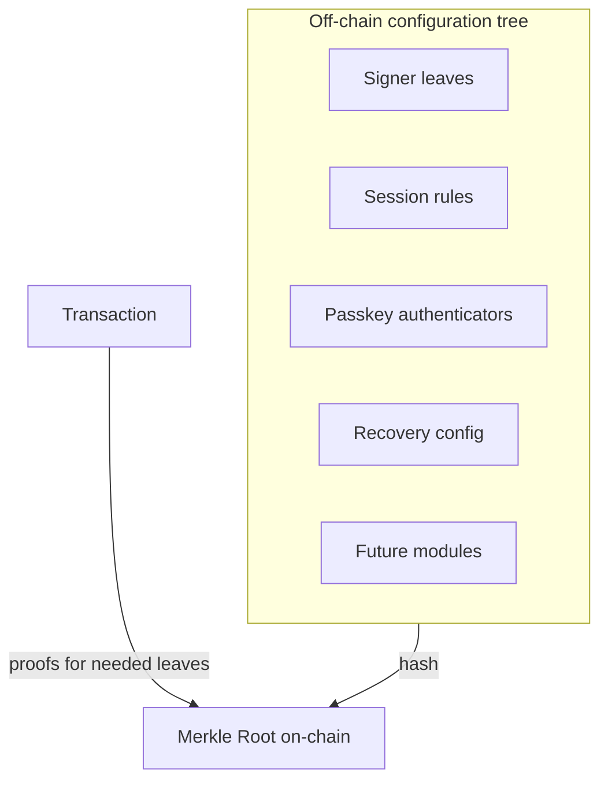
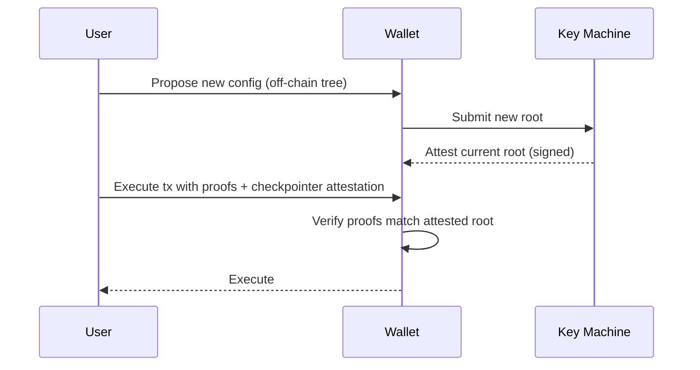

Ecosystem Wallets store a single **Merkle root** on-chain that commits to the entire wallet configuration: signers, weights, thresholds, passkey authenticators, Smart Session rules, recovery mechanisms, and future extensions. Actions provide **Merkle proofs** to validate the parts of the configuration that are relevant at execution time.

## Model

- **Root**: the wallet contract stores one hash root.
- **Leaves**: typed records for signers, sessions, recovery, passkeys, and modules.
- **Extensions**: modules interpret specific leaf types (e.g., session enforcement, passkeys).
- **Proofs**: execution supplies Merkle proofs for the leaves it needs (e.g., signer weight, session rule).

## Updating configuration

Configuration updates (add device, change session limits, rotate keys) happen off-chain by computing a new tree and root. **Key Machine** service attests to the latest root; transactions can include or reference this attestation so the wallet accepts only the latest configuration.

## Smart Sessions and Passkeys

- **Smart Sessions**: leaves define scopes for a session key (allowed contracts/functions, spend limits, expiries). Execution validates the session key and rule proofs before allowing actions.
- **Passkeys**: passkey authenticators are leaves; devices produce WebAuthn signatures that are validated by the passkey extension using the relevant leaf proof.

## Recovery

- **Timed recovery keys**: a recovery leaf encodes a time-lock window; initiating recovery starts a countdown where existing signers can cancel. After expiry, the recovery key can rotate primary signers.

## Efficiency

- Only the root is stored on-chain; proofs are provided as calldata when needed.
- Packing and bitmap techniques minimize calldata for multi-sig or multi-proof cases.

## Cross-chain coherency

- The same root governs all chains for a wallet; checkpointer attestations allow each network to accept only the canonical root, preventing replay with stale configurations.

## References

- [Wallet Contracts](https://github.com/0xsequence/wallet-contracts-v3)
