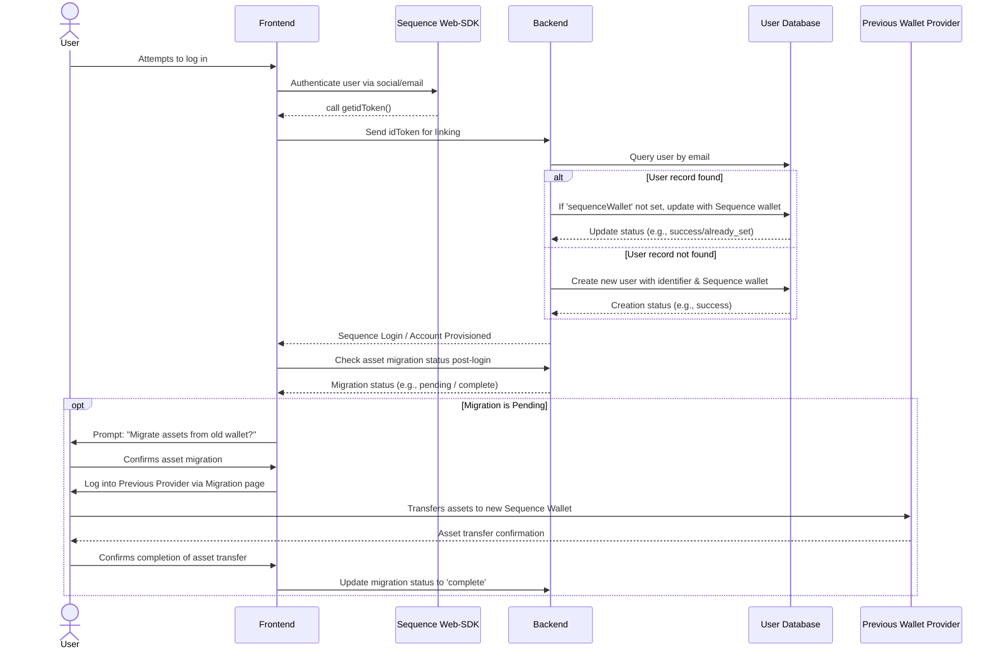

## Overview

This document provides guidance for users migrating from other providers (such as thirdweb, Venly, etc.) to Sequence's Embedded Wallets. The primary recommended approach is a Just-In-Time (JIT) migration pattern, which occurs when users log in for the first time after the migration.
<CardGroup>
  <Card title="thirdweb to Sequence" icon="book" href="/solutions/wallets/embedded-wallet/migration#migrating-from-thirdweb-to-sequence">
    Follow this guide to migrate from thirdweb In-App Wallets to Sequence.
  </Card>
</CardGroup>

## Recommended Migration Process

The migration process is designed to smoothly transition users from their existing wallet provider to Sequence Embedded Wallets with minimal disruption to their experience. Our Web-SDK leverages wagmi methods under the hood, so most existing logic in your application will be compatible. This process occurs automatically when a user logs in for the first time after the migration has been implemented where the process looks like the following generally:



1. **User Authentication**
   - When a user attempts to log in, user authenticates with their desired social provider or email using a Sequence SDK.
   - Once the user is authenticated, the user data such as email address or other unique user identifier along with the Sequence wallet address is passed to your backend.
  
    You can request a Sequence-specific `idToken` from the Sequence SDK and pass it to your backend to verify the user email and address from there to link it in your backend.

   [Here's](https://docs.sequence.xyz/sdk/headless-wallet/verification) the guide to request the token from your frontend and verify it from your backend.

2. **Database Lookup and Update**
Now that we have verified credentials in your backend, we can modify your user database to track if a Sequence wallet exists for the user already.
   - Update your user database with a 'sequenceWallet' column.
   - The database is queried with the unique user identifier to retrieve the corresponding user's record.
   - The system checks if a 'sequenceWallet' already exists for this user. If so, no action is taken.
   - If no Sequence wallet address is found:
     a. The passed sequence wallet is inserted in the 'sequenceWallet' column.
   - If a user doesn't exist in the database, insert the passed information as a net-new user.

3. **Asset Migration**
   - After the user is successfully logged in, the system checks if asset migration has already occurred.
   - If not, a prompt is displayed to the user, explaining the need to migrate their assets from their old wallet to the new Sequence wallet.
   - The user logs in to the previous provider as a one-time event via a specific migration page, and moves their desired assets to their new Sequence wallet. 
   - We suggest using Sequence's Indexer to query the relevant assets to display these along with amounts to the user for ease of migration.

Please get in touch with any questions if your migration differs significantly.

We'll outline below guides on migrating from specific providers below.

# Migrating from thirdweb to Sequence

## User Authentication

Thirdweb offers its own providers and authentication methods. To begin the migration process, it's important to identify where these are used in your codebase.

Once you know where these are located you will be be able to switch to the Sequence.

### Sequence dependencies installation

```bash pnpm
npm install @0xsequence/connect wagmi ethers@6.13.0 viem 0xsequence @tanstack/react-query
# or
pnpm install @0xsequence/connect wagmi ethers@6.13.0 viem 0xsequence @tanstack/react-query
# or
yarn add @0xsequence/connect wagmi ethers@6.13.0 viem 0xsequence @tanstack/react-query
```

### Migrating from thirdweb Providers to Sequence Providers

<CodeGroup>

```diff diff

- import { ThirdwebProvider } from "thirdweb/react";
+ import React from "react";
+ import ReactDOM from "react-dom/client";
+ import "./index.css";

+ import App from "./App";
+ import { config } from "./config";
+ import { SequenceConnect } from "@0xsequence/connect";

function MainLayout() {
  return (
-		<ThirdwebProvider>
+			<SequenceConnect config={config}>
+				<App />
+			</SequenceConnect>
-		</ThirdwebProvider>
  );
}
```

```ts MainLayout.tsx
import React from "react";
import ReactDOM from "react-dom/client";
import "./index.css";

import App from "./App";
import { config } from "./config";
import { SequenceConnect } from "@0xsequence/connect";

function Dapp() {
  return (
    <SequenceConnect config={config}>
      <App />
    </SequenceConnect>
  );
}

ReactDOM.createRoot(document.getElementById("root")!).render(
  <React.StrictMode>
    <Dapp />
  </React.StrictMode>
);
```

</CodeGroup>

Now you are ready to replace thirdweb login functions with Sequence Login Functions, allowing users to log in and automatically create an Embedded Wallet for each user

### Migrating from thirdweb Login Functions to Sequence Login Functions

<CodeGroup>

```diff diff
- import { ConnectButton } from "thirdweb/react";
- import { client } from "../client";
+ import { useOpenConnectModal } from '@0xsequence/connect'

export function Landing() {
+ const { setOpenConnectModal } = useOpenConnectModal()
  
  return (
-   <ConnectButton client={client} />
+   <button onClick={() => setOpenConnectModal(true)}>Connect</button>
  )
}
```

```ts Connect.tsx
import { useOpenConnectModal } from '@0xsequence/connect'

export function Landing() {
  const { setOpenConnectModal } = useOpenConnectModal()
  
  return (
    <button onClick={() => setOpenConnectModal(true)}>Connect</button>
  )
}
```

</CodeGroup>

If you're specifically focused on the migration experience, there's also a [dedicated example repository](https://github.com/0xsequence-demos/embedded-wallet-migration) that helps users view their NFTs, switch between chains, and transfer assets from a thirdweb account to another wallet.

If you're starting from scratch with Sequence integration, you can use one of the following repositories as a project base:

* [React Boilerplate](https://github.com/0xsequence-demos/kit-embedded-wallet-react-boilerplate) – A React-based starter project integrated with the Sequence Embedded Wallet.

* [Next.js Boilerplate](https://github.com/0xsequence-demos/kit-embedded-wallet-nextjs-boilerplate) – A Next.js-based starter project also integrated with the Sequence Embedded Wallet.

Both come with Sequence Embedded Wallet integration out of the box.

You will have to as well set Sequence specific configuration variables via the Web-SDK which you can find out more [here](https://docs.sequence.xyz/sdk/web/getting-started#setting-up-your-dapp).

Then request the Sequence idToken once a user is authenticated and pass it to your backend via this [guide](https://docs.sequence.xyz/sdk/web/guides/verification).

From here, continue with [Step 2](https://docs.sequence.xyz/solutions/wallets/embedded-wallet/migration#recommended-migration-process) depending on your backend and user database to track the migration process for your users.

Lastly, once a user successfully has a sequence wallet and your backend updated to track the status - prompt the user to migrate their assets via a dedicated migration page. The user would simply login with their thirdweb credentials and transfer their assets to their Sequence wallet to complete the flow.

